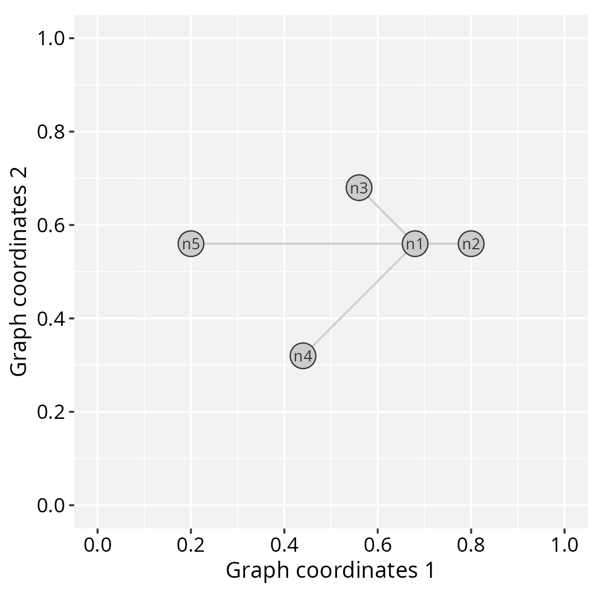
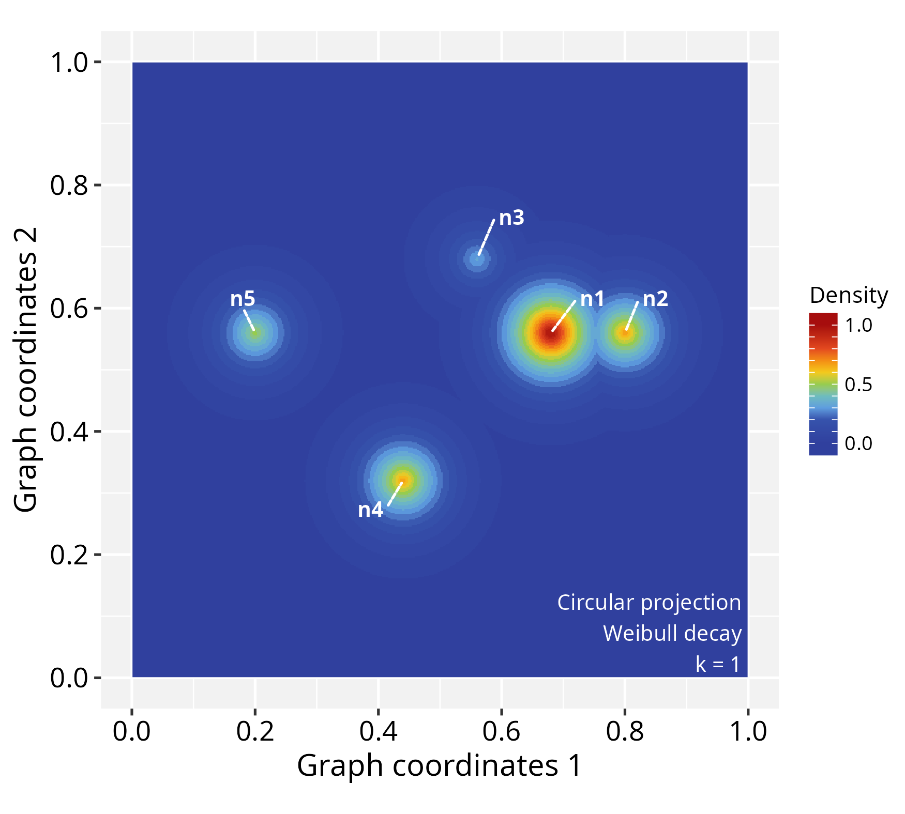
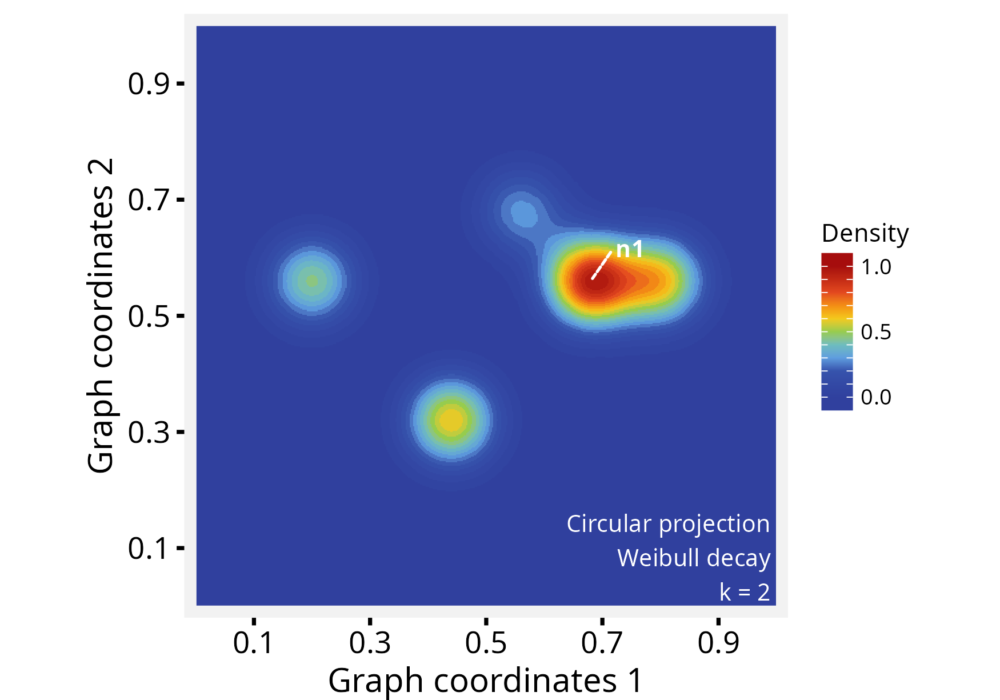
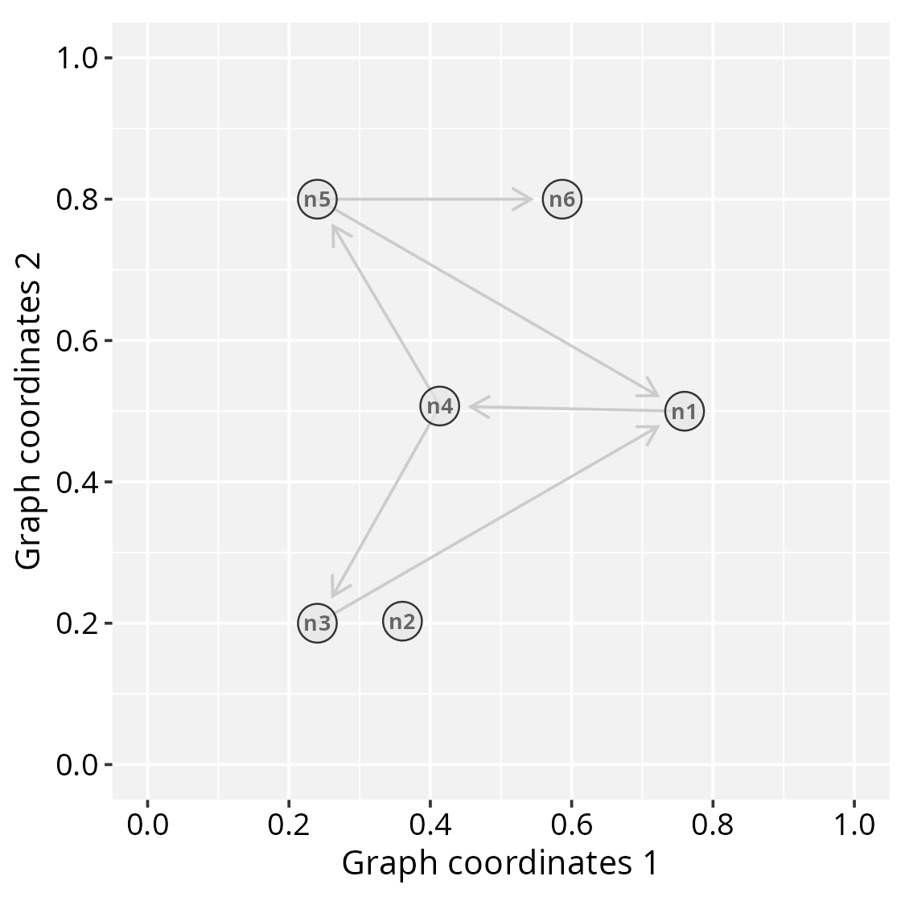
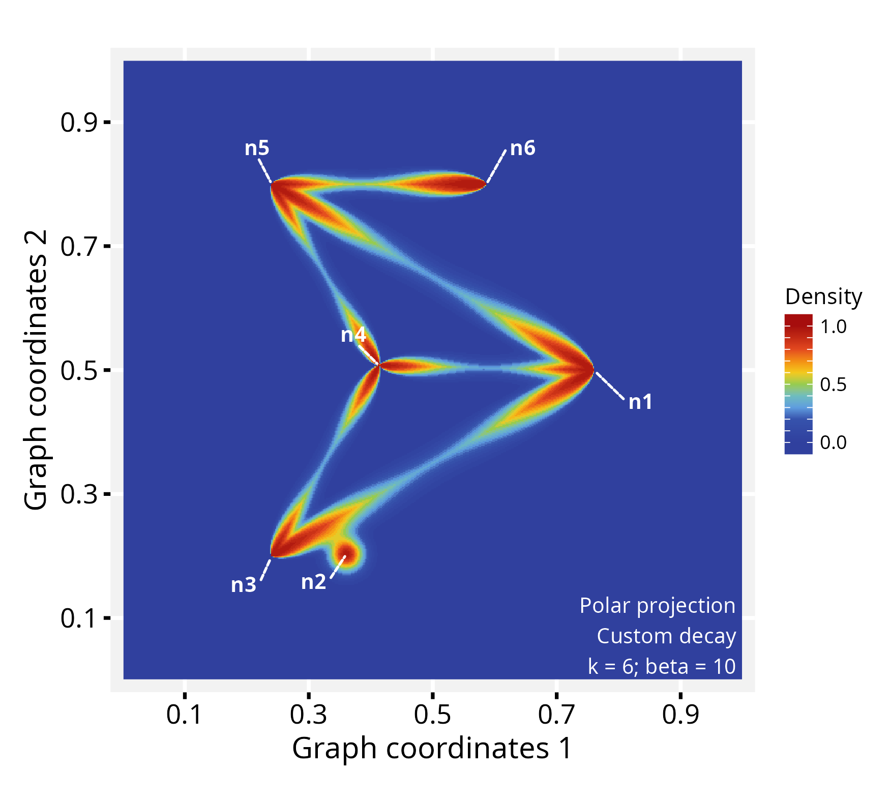
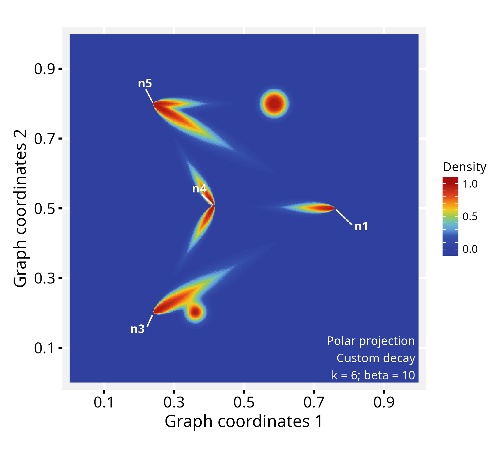
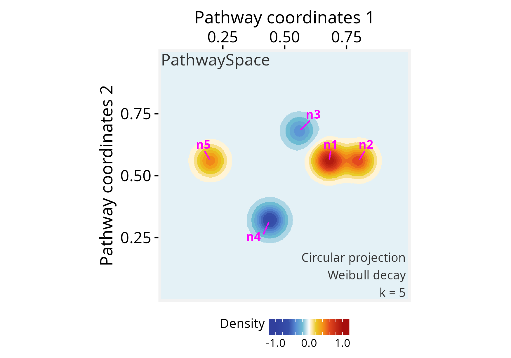

# Getting started with \*PathwaySpace\* projection methods

**Package**: PathwaySpace 1.3.9

## Highlights

- Produces landscape images representing graphs by geodesic paths
- Projects signals using a decay function to model signal attenuation
- Applies a convolution algorithm to combine signals from neighboring
  vertices

## Overview

For a given *igraph* object containing vertices, edges, and a signal
associated with the vertices, *PathwaySpace* performs a convolution
operation, which involves a weighted combination of neighboring signals
on a graph. **Figure 1A** illustrates the convolution operation problem.
Each vertex’s signal is positioned on a grid at specific `x` and `y`
coordinates, represented by cones (for available signals) or question
marks (for null or missing values).

![\*\*Figure 1.\*\* Signal processing addressed by the \*PathwaySpace\*
package. \*\*A\*\*) Graph overlaid on a 2D coordinate system. Each
projection cone represents the signal associated with a graph vertex
(referred to as \*vertex-signal positions\*), while question marks
indicate positions with no signal information (referred to as
\*null-signal positions\*). \*\*Inset\*\*: Graph layout of the toy
example used in this vignette. \*\*B\*\*) Illustration of signal
projection from two neighboring vertices, simplified to one dimension.
\*\*Right\*\*: Signal profiles from aggregation and decay
functions.](figures/fig1.png)

**Figure 1.** Signal processing addressed by the *PathwaySpace* package.
**A**) Graph overlaid on a 2D coordinate system. Each projection cone
represents the signal associated with a graph vertex (referred to as
*vertex-signal positions*), while question marks indicate positions with
no signal information (referred to as *null-signal positions*).
**Inset**: Graph layout of the toy example used in this vignette. **B**)
Illustration of signal projection from two neighboring vertices,
simplified to one dimension. **Right**: Signal profiles from aggregation
and decay functions.

  

*PathwaySpace* model considers the vertex-signal positions as source
points (or transmitters) and the null-signal positions as end points (or
receivers). The signal values from vertex-signal positions are then
projected to the null-signal positions according to a decay function,
which will control how the signal values attenuate as they propagate
across the 2D space. For a given null-signal position, the k-top signals
are used to define the contributing vertices for the convolution
operation, which will aggregate the signals from these contributing
vertices considering their intensities reaching the end points. Users
can adjust both the aggregation and decay functions; the aggregation
function can be any arithmetic rule that reduces a numeric vector into a
single scalar value (*e.g.*, mean, weighted mean), while available decay
functions include linear, exponential, and Weibull models (**Fig.1B**).
Additionally, users can assign vertex-specific decay functions to model
signal projections for subsets of vertices that may exhibit distinct
behaviors. The resulting image forms geodesic paths in which the signal
has been projected from vertex- to null-signal positions, using a
density metric to measure the signal intensity along these paths.

## Setting basic input data

``` r

#--- Load required packages for this section
library(igraph)
library(ggplot2)
library(RGraphSpace)
library(PathwaySpace)
```

This section will create an *igraph* object containing a binary signal
associated to each vertex. The graph layout is configured manually to
ensure that users can easily view all the relevant arguments needed to
prepare the input data for the *PathwaySpace* package. The *igraph*’s
[`make_star()`](https://r.igraph.org/reference/make_star.html) function
creates a star-like graph and the
[`V()`](https://r.igraph.org/reference/V.html) function is used to set
attributes for the vertices. The *PathwaySpace* package will require
that all vertices have `x`, `y`, and `name` attributes.

``` r

# Make a 'toy' igraph object, either a directed or undirected graph
gtoy1 <- make_star(5, mode="undirected")

# Assign 'x' and 'y' coordinates to each vertex
# ..this can be an arbitrary unit in (-Inf, +Inf)
V(gtoy1)$x <- c(0, 2, -2, -4, -8)
V(gtoy1)$y <- c(0, 0,  2, -4,  0)

# Assign a 'name' to each vertex (here, from n1 to n5)
V(gtoy1)$name <- paste0("n", 1:5)
```

## Checking graph validity

Next, we will create a *GraphSpace-class* object using the
[`GraphSpace()`](https://sysbiolab.github.io/RGraphSpace/reference/GraphSpace-methods.html)
constructor, followed by a call to
[`normalizeGraphSpace()`](https://sysbiolab.github.io/RGraphSpace/reference/normalizeGraphSpace-methods.html).
The constructor ensures the validity of the input *igraph* object, while
[`normalizeGraphSpace()`](https://sysbiolab.github.io/RGraphSpace/reference/normalizeGraphSpace-methods.html)
scales the network coordinates. In this example, we set `mar = 0.2` to
define the graph’s outer margins.

``` r

# Check graph validity
gs1 <- GraphSpace(gtoy1)
# Normalize node coordinates 
gs1 <- normalizeGraphSpace(gs1, mar = 0.2)
```

Our graph is now ready for the *PathwaySpace* package. We can check its
layout using the
[`plotGraphSpace()`](https://sysbiolab.github.io/RGraphSpace/reference/plotGraphSpace-methods.html)
function.

``` r

# Check the graph layout
plotGraphSpace(gs1, add.labels = TRUE)
```



## Creating a *PathwaySpace* object

Next, we will create a *PathwaySpace-class* object using the
[`buildPathwaySpace()`](https://github.com/sysbiolab/PathwaySpace/reference/buildPathwaySpace.md)
constructor. This will calculate pairwise distances between vertices,
subsequently required by the signal projection methods.

``` r

# Run the PathwaySpace constructor
p_space1 <- buildPathwaySpace(gs1)
```

As a default behavior, the
[`buildPathwaySpace()`](https://github.com/sysbiolab/PathwaySpace/reference/buildPathwaySpace.md)
constructor initializes the signal of each vertex as `0`. We can use the
[`vertexSignal()`](https://github.com/sysbiolab/PathwaySpace/reference/vertexSignal-accessors.md)
accessor to get and set vertex signals in a *PathwaySpace* object; for
example, in order to get vertex names and signal values:

``` r

# Check the number of vertices in the PathwaySpace object
length(p_space1)
## [1] 5

# Check vertex names
names(p_space1)
## [1] "n1" "n2" "n3" "n4" "n5"

# Check signal (initialized with '0')
vertexSignal(p_space1)
## n1 n2 n3 n4 n5 
##  0  0  0  0  0
```

…and for setting new signal values in *PathwaySpace* objects:

``` r

# Set new signal to all vertices
vertexSignal(p_space1) <- c(1, 4, 2, 4, 3)

# Set a new signal to the 1st vertex
vertexSignal(p_space1)[1] <- 2

# Set a new signal to vertex "n1"
vertexSignal(p_space1)["n1"] <- 6

# Check updated signal values
vertexSignal(p_space1)
## n1 n2 n3 n4 n5 
##  6  4  2  4  3
```

## Signal projection

### Circular projection

Following that, we will use the
[`circularProjection()`](https://github.com/sysbiolab/PathwaySpace/reference/circularProjection-methods.md)
function to project the network signals by the
[`weibullDecay()`](https://github.com/sysbiolab/PathwaySpace/reference/weibullDecay.md)
function with `pdist = 0.4`, which is passed by the `decay.fun`
argument. This term determines a distance unit for the signal
convolution, affecting the extent over which the convolution operation
projects the signal. For example, when `pdist = 1`, it will represent
the diameter of the inscribed circle within the coordinate space. We
also set `k = 1`, which defines the contributing vertices for signal
convolution.

``` r

# Run signal projection
p_space1 <- circularProjection(p_space1, k = 1, 
  decay.fun = weibullDecay(pdist = 0.4))

# Plot a PathwaySpace image
plotPathwaySpace(p_space1, add.marks = TRUE)
```



Next, we reassess the same *PathwaySpace* object, using `pdist = 0.2`,
`k = 2` and adjusting the `shape` of the decay function (for further
details, see the [**online
tutorials**](https://sysbiolab.github.io/PathwaySpace/)).

``` r

# Re-run signal projection, adjusting Weibull's shape
p_space1 <- circularProjection(p_space1, k = 2, 
  decay.fun = weibullDecay(shape = 2, pdist = 0.2))

# Plot PathwaySpace
plotPathwaySpace(p_space1, marks = "n1", theme = "th2")
```



The `shape` parameter allows a projection to take a variety of shapes.
When `shape = 1` the projection follows an exponential decay, and when
`shape > 1` the projection is first convex, then concave with an
inflection point along the decay path. For additional examples see the
[**modeling signal
decay**](https://sysbiolab.github.io/PathwaySpace/articles/modeling-signal-decay.html)
tutorial.

### Polar projection

In this section we will project network signals using a polar coordinate
system. This representation may be useful for certain types of data, for
example, to highlight patterns of signal propagation on directed graphs,
especially to explore the orientation aspect of signal flow. To
demonstrate this feature we will used the `gtoy2` directed graph,
available in the *RGraphSpace* package.

``` r

# Load a pre-processed directed igraph object
data("gtoy2", package = "RGraphSpace")
# Check graph validity
gs2 <- GraphSpace(gtoy2)
gs2 <- normalizeGraphSpace(gs2, mar = 0.2)
```

``` r

# Check the graph layout
plotGraphSpace(gs2, add.labels = TRUE)
```



``` r

# Build a PathwaySpace for the 'gs2'
p_space2 <- buildPathwaySpace(gs2)

# Set '1s' as vertex signal
vertexSignal(p_space2) <- 1
```

For fine-grained modeling of signal decay, the
[`vertexDecay()`](https://github.com/sysbiolab/PathwaySpace/reference/vertexSignal-accessors.md)
accessor allows assigning decay functions at the level of individual
vertices. For example, adjusting Weibull’s `shape` argument for node
`n6`:

``` r

# Modify decay function
# ..for all vertices
vertexDecay(p_space2) <- weibullDecay(shape=2, pdist = 1)
# ..for individual vertices
vertexDecay(p_space2)[["n6"]] <- weibullDecay(shape=3, pdist = 1)
```

In polar projections, the `pdist` term defines a reference distance
related to edge length, aiming to constrain signal projections within
edge bounds. Here we set `pdist = 1` to reach full edge lengths. Next,
we run the signal projection using polar coordinates. The `beta`
exponent will control the angular span; for values greater than zero,
`beta` will progressively narrow the projection along the edge axis.

``` r

# Run signal projection using polar coordinates
p_space2 <- polarProjection(p_space2, beta = 10)

# Plot PathwaySpace
plotPathwaySpace(p_space2, theme = "th2", add.marks = TRUE)
```



Note that this projection distributes signals on the edges regardless of
direction. To incorporate edge orientation, we set `directional = TRUE`,
which channels the projection along the paths:

``` r

# Re-run signal projection using 'directional = TRUE'
p_space2 <- polarProjection(p_space2, 
  beta = 10, directional = TRUE)

# Plot PathwaySpace
plotPathwaySpace(p_space2, theme = "th2", 
  marks = c("n1","n3","n4","n5"))
```



This *PathwaySpace* polar projection emphasizes the signal flow along
the directional pattern of a directed graph (see the *igraph* plot
above). When interpreting, users should note that this approach
introduces simplifications; for example, depending on the network
topology, the polar projection may fail to capture complex features of
directed graphs, such as cyclic dependencies, feedforward and feedback
loops, or other intricate interactions.

## Signal types

The *PathwaySpace* accepts binary, integer, and numeric signal types,
including `NAs`. If a vertex signal is assigned with `NA`, it will be
ignored by the convolution algorithm. Logical values are also allowed,
but it will be treated as binary. Next, we show the projection of a
signal that includes negative values, using the `p_space1` object
created previously.

``` r

# Set a negative signal to vertices "n3" and "n4"
vertexSignal(p_space1)[c("n3","n4")] <- c(-2, -4)

# Check updated signal vector
vertexSignal(p_space1)
# n1 n2 n3 n4 n5 
#  6  4 -2 -4  3 

# Re-run signal projection
p_space1 <- circularProjection(p_space1, 
  decay.fun = weibullDecay(shape = 2))

# Plot PathwaySpace
plotPathwaySpace(p_space1, bg.color = "white", 
  font.color = "grey20", add.marks = TRUE, 
  mark.color = "magenta", theme = "th3")
```



Note that the original signal vector was rescale to `[-1, +1]`. If the
signal vector is `>=0`, then it will be rescaled to `[0, 1]`; if the
signal vector is `<=0`, it will be rescaled to `[-1, 0]`; and if the
signal vector is in `(-Inf, +Inf)`, then it will be rescaled to
`[-1, +1]`. To override this signal processing, simply set
`rescale = FALSE` in the projection function.

## Online tutorials

<https://sysbiolab.github.io/PathwaySpace/>

## Citation

If you use *PathwaySpace*, please cite:

- Tercan & Apolonio et al. Protocol for assessing distances in pathway
  space for classifier feature sets from machine learning methods. *STAR
  Protocols* 6(2):103681, 2025.
  <https://doi.org/10.1016/j.xpro.2025.103681>

- Ellrott et al. Classification of non-TCGA cancer samples to TCGA
  molecular subtypes using compact feature sets. *Cancer Cell*
  43(2):195-212.e11, 2025. <https://doi.org/10.1016/j.ccell.2024.12.002>

## Other useful links

- RGraphSpace: A Lightweight Interface Between ‘ggplot2’ and ‘igraph’
  Objects <https://cran.r-project.org/package=RGraphSpace>

- RedeR: Interactive visualization and manipulation of nested networks
  <https://bioconductor.org/packages/RedeR/>

## Session information

    ## R version 4.6.0 (2026-04-24)
    ## Platform: x86_64-pc-linux-gnu
    ## Running under: Ubuntu 24.04.4 LTS
    ## 
    ## Matrix products: default
    ## BLAS:   /usr/lib/x86_64-linux-gnu/openblas-pthread/libblas.so.3 
    ## LAPACK: /usr/lib/x86_64-linux-gnu/openblas-pthread/libopenblasp-r0.3.26.so;  LAPACK version 3.12.0
    ## 
    ## locale:
    ##  [1] LC_CTYPE=en_US.UTF-8       LC_NUMERIC=C              
    ##  [3] LC_TIME=en_US.UTF-8        LC_COLLATE=en_US.UTF-8    
    ##  [5] LC_MONETARY=en_US.UTF-8    LC_MESSAGES=en_US.UTF-8   
    ##  [7] LC_PAPER=en_US.UTF-8       LC_NAME=C                 
    ##  [9] LC_ADDRESS=C               LC_TELEPHONE=C            
    ## [11] LC_MEASUREMENT=en_US.UTF-8 LC_IDENTIFICATION=C       
    ## 
    ## time zone: America/Sao_Paulo
    ## tzcode source: system (glibc)
    ## 
    ## attached base packages:
    ## [1] stats     graphics  grDevices utils     datasets  methods   base     
    ## 
    ## other attached packages:
    ## [1] PathwaySpace_1.3.9 RGraphSpace_1.4.1  ggplot2_4.0.3      igraph_2.3.2      
    ## 
    ## loaded via a namespace (and not attached):
    ##  [1] sass_0.4.10        generics_0.1.4     tidyr_1.3.2        lattice_0.22-9    
    ##  [5] digest_0.6.39      magrittr_2.0.5     evaluate_1.0.5     grid_4.6.0        
    ##  [9] RColorBrewer_1.1-3 fastmap_1.2.0      jsonlite_2.0.0     Matrix_1.7-5      
    ## [13] ggrepel_0.9.8      ggnewscale_0.5.2   ggrastr_1.0.2      purrr_1.2.2       
    ## [17] scales_1.4.0       textshaping_1.0.5  jquerylib_0.1.4    cli_3.6.6         
    ## [21] rlang_1.2.0        tidygraph_1.3.1    RANN_2.6.2         withr_3.0.2       
    ## [25] cachem_1.1.0       yaml_2.3.12        otel_0.2.0         ggbeeswarm_0.7.3  
    ## [29] tools_4.6.0        dplyr_1.2.1        colorspace_2.1-2   vctrs_0.7.3       
    ## [33] R6_2.6.1           lifecycle_1.0.5    fs_2.1.0           htmlwidgets_1.6.4 
    ## [37] vipor_0.4.7        ragg_1.5.2         pkgconfig_2.0.3    beeswarm_0.4.0    
    ## [41] desc_1.4.3         pkgdown_2.2.0      pillar_1.11.1      bslib_0.11.0      
    ## [45] gtable_0.3.6       Rcpp_1.1.1-1.1     glue_1.8.1         systemfonts_1.3.2 
    ## [49] xfun_0.58          tibble_3.3.1       tidyselect_1.2.1   rstudioapi_0.18.0 
    ## [53] knitr_1.51         farver_2.1.2       patchwork_1.3.2    htmltools_0.5.9   
    ## [57] rmarkdown_2.31     compiler_4.6.0     S7_0.2.2
