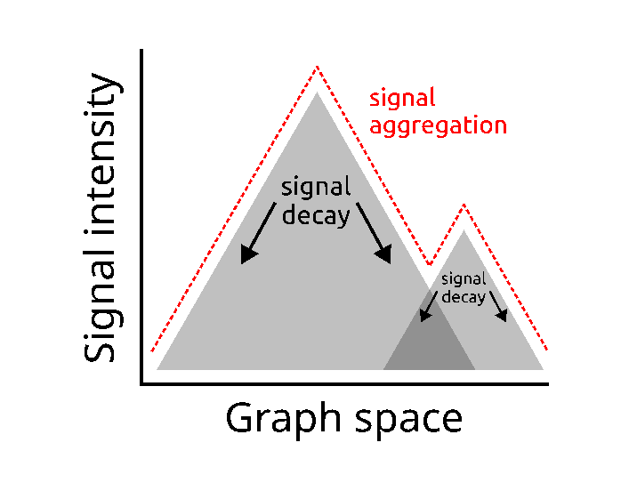
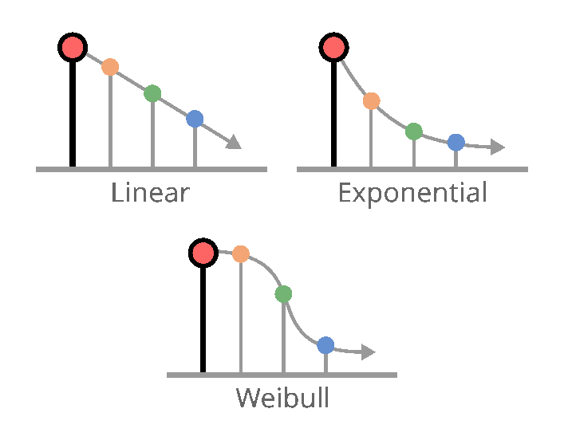
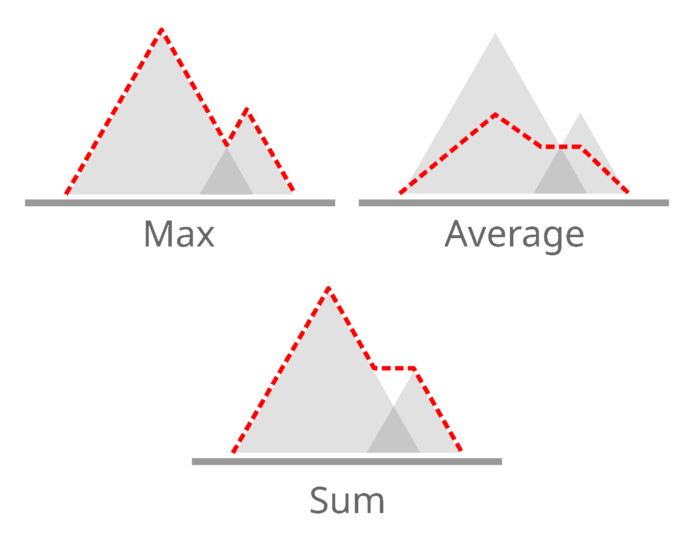
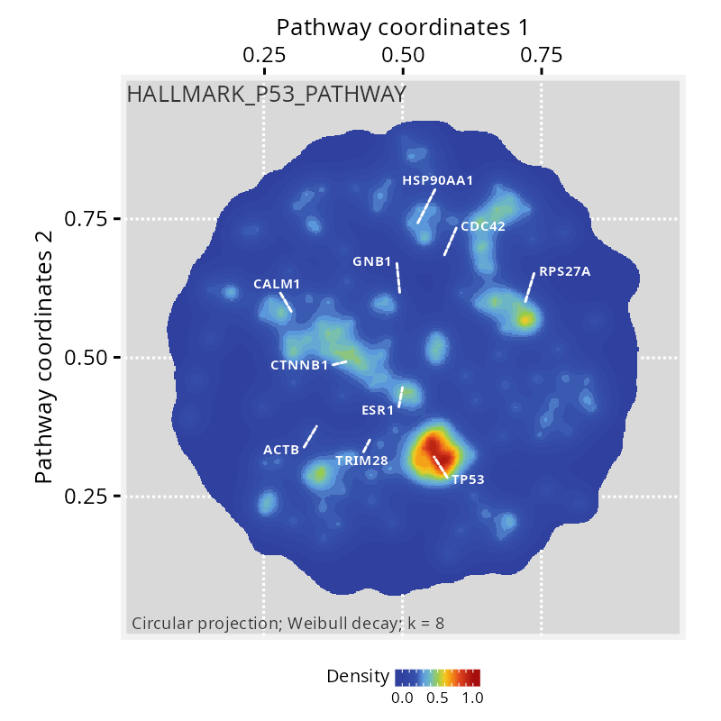
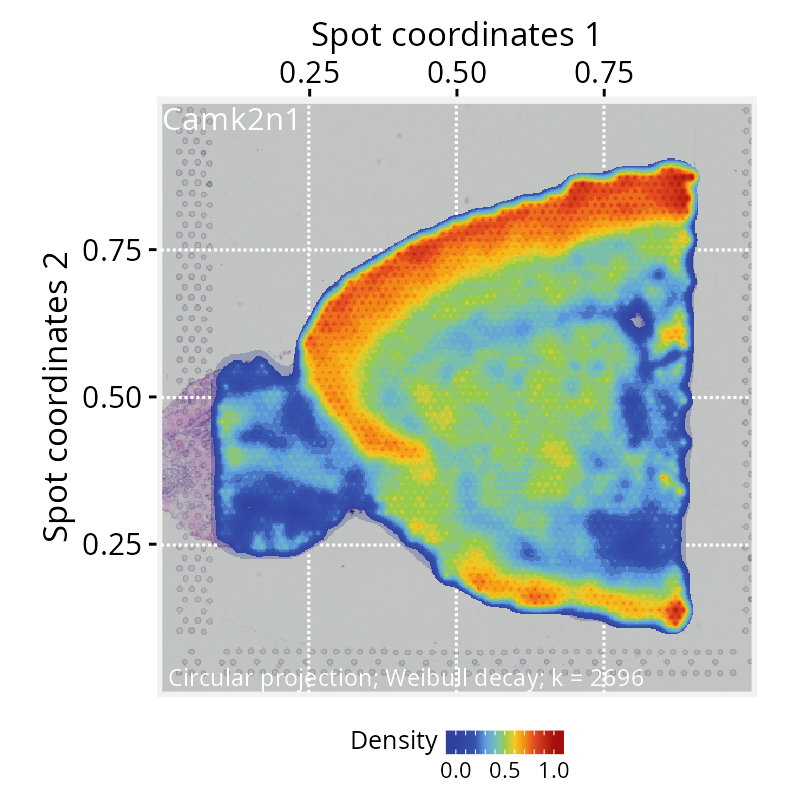

# Getting started with PathwaySpace

## Introductory vignettes

These tutorials introduce *PathwaySpace* using simple toy examples:
**Network Signal Projections** walks through the main *PathwaySpace*
projection methods; **Signal Decay Functions** describes how to set up
decay functions to model specific network nodes; and **Signal
Aggregation Rules** demonstrates how to create signal aggregation
functions to emphasize patterns in the data.

###### Network Signal Projections

###### Signal Decay Functions

###### Signal Aggregation Rules

------------------------------------------------------------------------

## Visualizing features in *PathwaySpace*

These tutorials showcase *PathwaySpace* applied to real-world scenarios,
highlighting complex feature patterns. The **Sparse Feature Sets**
vignette demonstrates how to analyze feature signals when only a limited
number of nodes carry relevant information, while the **Spatial
Transcriptomics** vignette illustrates how to project gene expression
signals across tissue sections.

###### Sparse Feature Sets

###### Spatial Transcriptomics
