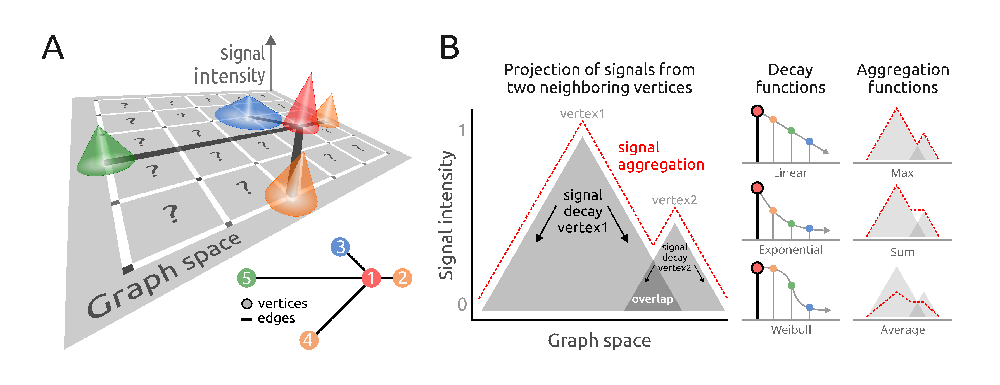

# PathwaySpace Overview

For a given *igraph* object containing vertices, edges, and a signal
associated with the vertices, *PathwaySpace* performs a convolution
operation, which involves a weighted combination of neighboring signals
on a graph. **Figure 1A** illustrates the convolution operation problem.
Each vertex’s signal is positioned on a grid at specific `x` and `y`
coordinates, represented by cones (for available signals) or question
marks (for null or missing values).

**Figure 1.** Signal processing addressed by the
*PathwaySpace* package. **A**) Graph overlaid on a 2D coordinate system.
Each projection cone represents the signal associated with a graph
vertex (referred to as *vertex-signal positions*), while question marks
indicate positions with no signal information (referred to as
*null-signal positions*). **Inset**: Graph layout of the toy example
used in the *quick start* section of this vignette. **B**) Illustration
of signal projection from two neighboring vertices, simplified to one
dimension. **Right**: Signal profiles from aggregation and decay
functions.
