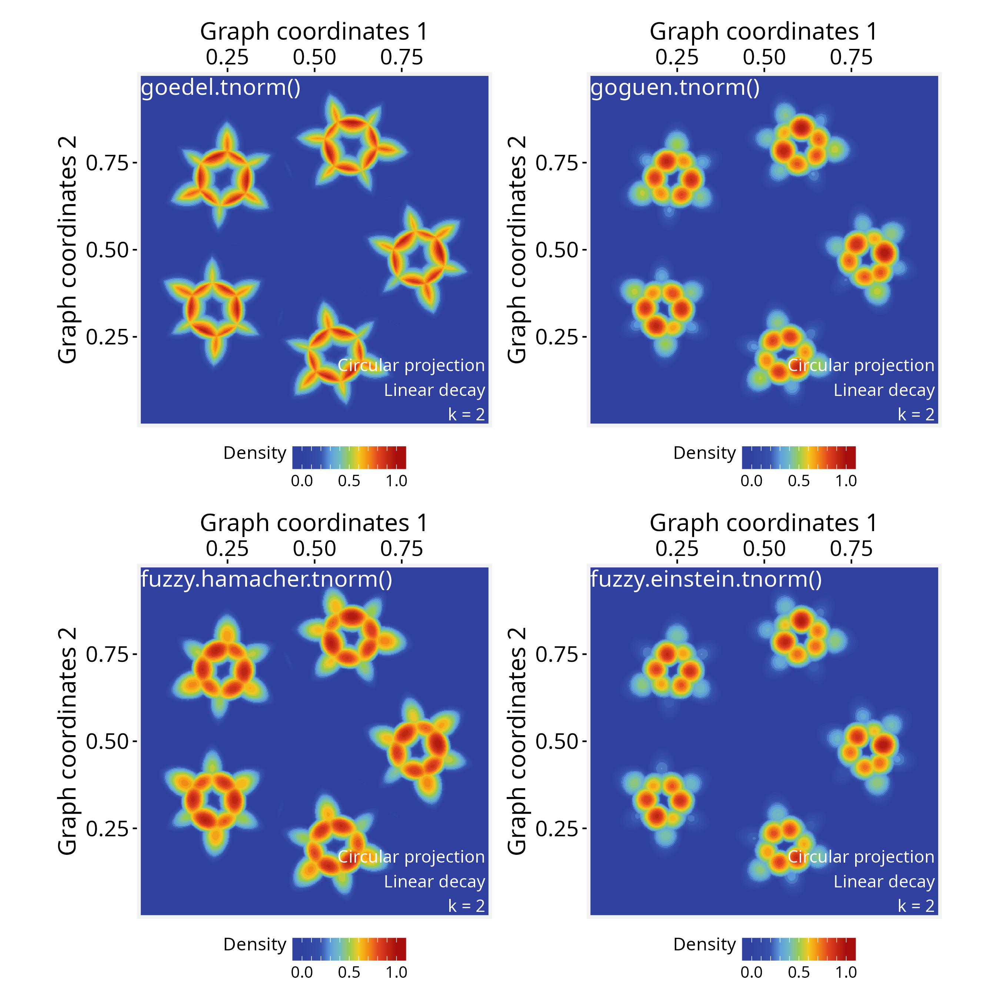

# Creating signal aggregation rules

**Package**: PathwaySpace 1.2.4  

## Overview

When aggregating multiple signals over a space, such as *PathwaySpace*
projections, it’s often not enough to simply add or average their
values, given that each signal carries uncertainty or partial
information.

For practical implementation with *PathwaySpace* projections, any unary
aggregation function of the form **`function(x) { ... }`** can be
plugged into the pipeline, which has essentially two steps: (i) map raw
signal intensities to a decay function, such as linear, exponential, or
sigmoidal, depending on the data (see [*modeling signal
decay*](https://github.com/sysbiolab/PathwaySpace/articles/modeling-signal-decay.md));
and (ii) use an appropriate operation to produce a combined projection.
The decay function models the signal propagation, each vertex emitting a
projection that decreases with distance, reflecting both the local
strength of the signal and its spatial influence. Because a graph may
have multiple vertices, the resulting projections can be aggregated in
different ways (see [**Figure
1**](https://github.com/sysbiolab/PathwaySpace/articles/overview.md) for
a conceptual overview of signal processing in *PathwaySpace*).

In what follows, this tutorial demonstrates how to create different
signal aggregation functions for *PathwaySpace* projections. A toy graph
with five small islands is used to illustrate aggregation rules that
emphasize distinct patterns in the data. The final section suggests a
list of *fuzzy logic* operators that can be used to aggregate signals in
*PathwaySpace*, including the trade-offs of each approach.

## Required packages

``` r

# Check required packages for this vignette
if (!require("remotes", quietly = TRUE)){
  install.packages("remotes")
}
if (!require("RGraphSpace", quietly = TRUE)){
  remotes::install_github("sysbiolab/RGraphSpace")
}
if (!require("PathwaySpace", quietly = TRUE)){
  remotes::install_github("sysbiolab/PathwaySpace")
}
```

``` r

# Check versions
if (packageVersion("RGraphSpace") < "1.2.0"){
  message("Need to update 'RGraphSpace' for this vignette")
  remotes::install_github("sysbiolab/RGraphSpace")
}
if (packageVersion("PathwaySpace") < "1.2.0"){
  message("Need to update 'PathwaySpace' for this vignette")
  remotes::install_github("sysbiolab/PathwaySpace")
}
```

``` r

# Load packages
library(igraph)
library(ggplot2)
library(RGraphSpace)
library(PathwaySpace)
library(patchwork)
```

## Setting basic input data

``` r

# Create a simple graph with five islands
g <- rep(igraph::make_star(7, "undirected"), 5)
V(g)$name <- paste0("n",1:vcount(g))
set.seed(123) # for reproducible 'layout_with_fr'
gs <- GraphSpace(g, layout = layout_with_fr(g))
gs <- normalizeGraphSpace(gs)
plotGraphSpace(gs, add.labels = TRUE)
```


``` r

# Build a PathwaySpace object
ps <- buildPathwaySpace(gs)
```

## Assigning a decay model

Next, we will assign a linear decay model for all vertices (for
additional details, see the [*modeling signal
decay*](https://github.com/sysbiolab/PathwaySpace/articles/modeling-signal-decay.md)
tutorial).

``` r

# Get distance to the nearest vertex
near_df <- getNearestNode(ps)
pdist <- mean(near_df$dist)
# 'pdist' set as the average center-to-center distance between vertices
pdist
```

    ## [1] 0.09879871

``` r

# Setting a linear decay model for all vertices
vertexDecay(ps) <- linearDecay(pdist = pdist)
```

As a default behavior, the
[`buildPathwaySpace()`](https://github.com/sysbiolab/PathwaySpace/reference/buildPathwaySpace.md)
constructor initializes each vertex’s signal with `0` (for more details,
see the [*signal
types*](https://github.com/sysbiolab/PathwaySpace/articles/projection-methods.html#Signal_types)
section). We will update this signal, setting peak values at the central
vertices or hubs.

``` r

# Find hubs 
hubs <- degree(ps@graph)
hubs <- hubs[hubs>1]
# Add signal
vertexSignal(ps) <- 1
vertexSignal(ps)[names(hubs)] <- 2
# Vertex count
gs_vcount(ps)
```

    ## [1] 35

## Creating aggregation rules

### Means, max, and min

Now we project the signals using the
[`circularProjection()`](https://github.com/sysbiolab/PathwaySpace/reference/circularProjection-methods.md)
function, in which the `aggregate.fun` argument defines the aggregation
rule. This argument accepts any user-defined unary aggregation function
that aggregates a vector of numeric values into a single scalar output.

In the examples below, we compare two approaches: a standard *arithmetic
mean*, where all values contribute equally, and a *self-weighted
(contraharmonic) mean*, where each value is weighted by its own
magnitude.

``` r

# Signal aggregation by 'mean'
ps <- circularProjection(ps, k = gs_vcount(ps), aggregate.fun = mean)
p1 <- plotPathwaySpace(ps, theme = "th3", title = "mean()")

# Signal aggregation by a 'self-weighted mean'
# (generalized contraharmonic to -/+ values)
wmean <- function(x){ weighted.mean(x, abs(x)) }
ps <- circularProjection(ps, k = gs_vcount(ps), aggregate.fun = wmean)
p2 <- plotPathwaySpace(ps, theme = "th3", title = "wmean()")

p1 + p2
```


These examples show how changes in weighting (from equal weights to
self-weights) affects the combined projection: The standard *arithmetic
mean* may be used when we want to emphasize the influence of local
groups, while the *self-weighted mean* will shift the mean toward the
more dominant signals.

Next, we assign new aggregation functions to explore different rules.
The `max` function also emphasizes the dominant signals while the `min`
function will highlight the regions where projections intersect between
neighbor vertices.

``` r

# Signal aggregation by 'max'
ps <- circularProjection(ps, k = gs_vcount(ps), aggregate.fun = max)
p1 <- plotPathwaySpace(ps, theme = "th3", title = "max()")

# Signal aggregation by 'min'
ps <- circularProjection(ps, k = 2, aggregate.fun = min)
p2 <- plotPathwaySpace(ps, theme = "th3", title = "min()")

p1 + p2
```


Note that the `k` parameter affects the aggregations, as it determines
how many projected signals are considered at each point in space. In
general, we recommend using `k = gs_vcount(ps)` to capture contributions
from all vertices, except in special cases, such as the example above
using the `min` function, where the aggregation aims to highlight
minimal values between two neighbor vertices.

### Fuzzy unions and intersections

This section lists *fuzzy logic* functions that can be used to aggregate
signals in *PathwaySpace*, mostly available from the *lfl* package
(Burda and Štěpnička 2021). A fuzzy intersection measures how strongly
all signals agree at a given point, typically using a *t-norm* like
minimum or product. A fuzzy union, in contrast, measures how strong any
of the signals are at a given point, using a *t-conorm* like maximum. By
combining fuzzy unions or intersections with decay functions, we can
produce unified projections that integrate multiple signal sources into
a single, interpretable representation.

``` r

if (!require("lfl", quietly = TRUE)){
  install.packages("lfl")
}
# Load Fuzzy Logic functions
library(lfl)
```

#### T-norms (Triangular Norms)

These functions represent fuzzy “AND” operations:

``` r

# Goedel t-norm: use when aggregation should be strictly limited by the weakest
# signal (logical AND, conservative intersection);
# Input range in [0, 1]
ps <- circularProjection(ps, k = 2, aggregate.fun = goedel.tnorm)
plotPathwaySpace(ps, theme = "th3")

# Goguen t-norm: use when you want smooth multiplicative attenuation of 
# overlapping signals (probabilistic AND);
# Input range in [0, 1]
ps <- circularProjection(ps, k = 2, aggregate.fun = goguen.tnorm)
plotPathwaySpace(ps, theme = "th3")

# Hamacher product t-norm: use when you need smoothness in signal intersections;
# Input range in [-Inf, Inf];
fuzzy.hamacher.tnorm <- function(x) {
  Reduce(function(a, b) (a * b) / (a + b - a * b), x)
}
ps <- circularProjection(ps, k = 2, aggregate.fun = fuzzy.hamacher.tnorm)
plotPathwaySpace(ps, theme = "th3")

# Einstein product t-norm: use when combining signals should preserve low values
# without collapsing to zero;
# Input range in [-Inf, Inf]
fuzzy.einstein.tnorm <- function(x) {
  Reduce(function(a, b) (a * b) / (1 + (1 - a) * (1 - b)), x)
}
ps <- circularProjection(ps, k = 2, aggregate.fun = fuzzy.einstein.tnorm)
plotPathwaySpace(ps, theme = "th3")
```



#### T-conorms (Triangular Conorms)

These functions represent fuzzy “OR” operations:

``` r

# Goedel t-conorm: use when you want an extremely permissive OR, where the 
# strongest signal fully dominates the aggregation;
# Input range in [0, 1]
ps <- circularProjection(ps, k = gs_vcount(ps), aggregate.fun = goedel.tconorm)
plotPathwaySpace(ps, theme = "th3")

# Goguen t-conorm: use when overlapping signals should reinforce each other in 
# a probabilistic way (soft OR);
# Input range in  [0, 1]
ps <- circularProjection(ps, k = gs_vcount(ps), aggregate.fun = goguen.tconorm)
plotPathwaySpace(ps, theme = "th3")

# Lukasiewicz t-conorm: use when you want signal reinforcement, saturating at 1 
# once contributions accumulate;
# Input range in [0, 1]
ps <- circularProjection(ps, k = gs_vcount(ps), aggregate.fun = lukas.tconorm)
plotPathwaySpace(ps, theme = "th3")

# Hamacher sum t-conorm: use when you prefer a moderate, nonlinear signal reinforcement 
# that avoids rapid saturation;
# Input range in [0, 1]
fuzzy.hamacher.tconorm <- function(x) {
  stopifnot(is.numeric(x), all(x >= 0), all(x <= 1))
  Reduce(function(a, b) (a + b - 2 * a * b) / (1 - a * b), x)
}
ps <- circularProjection(ps, k = gs_vcount(ps), aggregate.fun = fuzzy.hamacher.tconorm)
plotPathwaySpace(ps, theme = "th3")

# Einstein sum t-conorm: use when signal reinforcement should be smooth and symmetric,
# limiting extreme increases;
# Input range in [-Inf, Inf]
fuzzy.einstein.tconorm <- function(x) {
  Reduce(function(a, b) (a + b) / (1 + a * b), x)
}
ps <- circularProjection(ps, k = gs_vcount(ps), aggregate.fun = fuzzy.einstein.tconorm)
plotPathwaySpace(ps, theme = "th3")
```


Note that most of the fuzzy functions listed above, including *t-norms*
(e.g., Goedel, Goguen, Hamacher) and *t-conorms* (e.g., Goedel, Goguen,
Lukasiewicz), operate within the unit interval, accepting input values
in `[0, 1]`. *PathwaySpace* also operate on this range of values for
positive signals by default (with `rescale = TRUE`; see
[`circularProjection()`](https://github.com/sysbiolab/PathwaySpace/reference/circularProjection-methods.md)
function); however, negative signals are rescaled to `[-1, 0]`, and
therefore are not directly compatible with these fuzzy operators (for
more details, see the [*signal
types*](https://github.com/sysbiolab/PathwaySpace/articles/projection-methods.html#Signal_types)
section).

Also, when evaluating input signals in the range `(-Inf, Inf)` (*e.g.*,
differential expression values), we recommend using aggregation
functions that treat negative and positive values symmetrically. In such
cases, the standard *arithmetic mean* and *self-weighted mean* provide
compatible sign-symmetric aggregation strategies.

## Session information

    ## R version 4.6.0 (2026-04-24)
    ## Platform: x86_64-pc-linux-gnu
    ## Running under: Ubuntu 24.04.4 LTS
    ## 
    ## Matrix products: default
    ## BLAS:   /usr/lib/x86_64-linux-gnu/openblas-pthread/libblas.so.3 
    ## LAPACK: /usr/lib/x86_64-linux-gnu/openblas-pthread/libopenblasp-r0.3.26.so;  LAPACK version 3.12.0
    ## 
    ## locale:
    ##  [1] LC_CTYPE=en_US.UTF-8       LC_NUMERIC=C              
    ##  [3] LC_TIME=en_US.UTF-8        LC_COLLATE=en_US.UTF-8    
    ##  [5] LC_MONETARY=en_US.UTF-8    LC_MESSAGES=en_US.UTF-8   
    ##  [7] LC_PAPER=en_US.UTF-8       LC_NAME=C                 
    ##  [9] LC_ADDRESS=C               LC_TELEPHONE=C            
    ## [11] LC_MEASUREMENT=en_US.UTF-8 LC_IDENTIFICATION=C       
    ## 
    ## time zone: America/Sao_Paulo
    ## tzcode source: system (glibc)
    ## 
    ## attached base packages:
    ## [1] stats     graphics  grDevices utils     datasets  methods   base     
    ## 
    ## other attached packages:
    ## [1] patchwork_1.3.2    igraph_2.3.1       PathwaySpace_1.2.4 RGraphSpace_1.2.4 
    ## [5] ggplot2_4.0.3      remotes_2.5.0     
    ## 
    ## loaded via a namespace (and not attached):
    ##  [1] sass_0.4.10        generics_0.1.4     tidyr_1.3.2        digest_0.6.39     
    ##  [5] magrittr_2.0.5     evaluate_1.0.5     grid_4.6.0         RColorBrewer_1.1-3
    ##  [9] fastmap_1.2.0      jsonlite_2.0.0     ggrepel_0.9.8      ggrastr_1.0.2     
    ## [13] purrr_1.2.2        scales_1.4.0       textshaping_1.0.5  jquerylib_0.1.4   
    ## [17] cli_3.6.6          rlang_1.2.0        tidygraph_1.3.1    withr_3.0.2       
    ## [21] RANN_2.6.2         cachem_1.1.0       yaml_2.3.12        otel_0.2.0        
    ## [25] ggbeeswarm_0.7.3   tools_4.6.0        dplyr_1.2.1        colorspace_2.1-2  
    ## [29] vctrs_0.7.3        R6_2.6.1           lifecycle_1.0.5    fs_2.1.0          
    ## [33] htmlwidgets_1.6.4  vipor_0.4.7        ragg_1.5.2         pkgconfig_2.0.3   
    ## [37] beeswarm_0.4.0     desc_1.4.3         pkgdown_2.2.0      pillar_1.11.1     
    ## [41] bslib_0.10.0       gtable_0.3.6       Rcpp_1.1.1-1.1     glue_1.8.1        
    ## [45] systemfonts_1.3.2  xfun_0.57          tibble_3.3.1       tidyselect_1.2.1  
    ## [49] rstudioapi_0.18.0  knitr_1.51         farver_2.1.2       htmltools_0.5.9   
    ## [53] rmarkdown_2.31     compiler_4.6.0     S7_0.2.2

## References

Burda, Michal, and Martin Štěpnička. 2021. “Lfl: An R Package for
Linguistic Fuzzy Logic.” *Fuzzy Sets and Systems*, ahead of print.
<https://doi.org/10.1016/j.fss.2021.07.007>.
