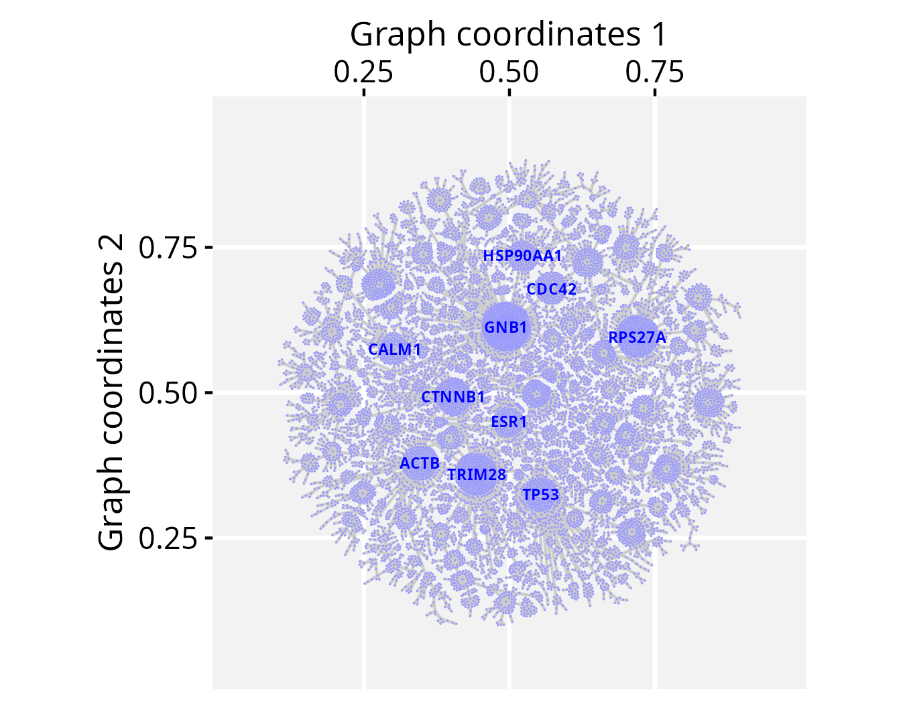
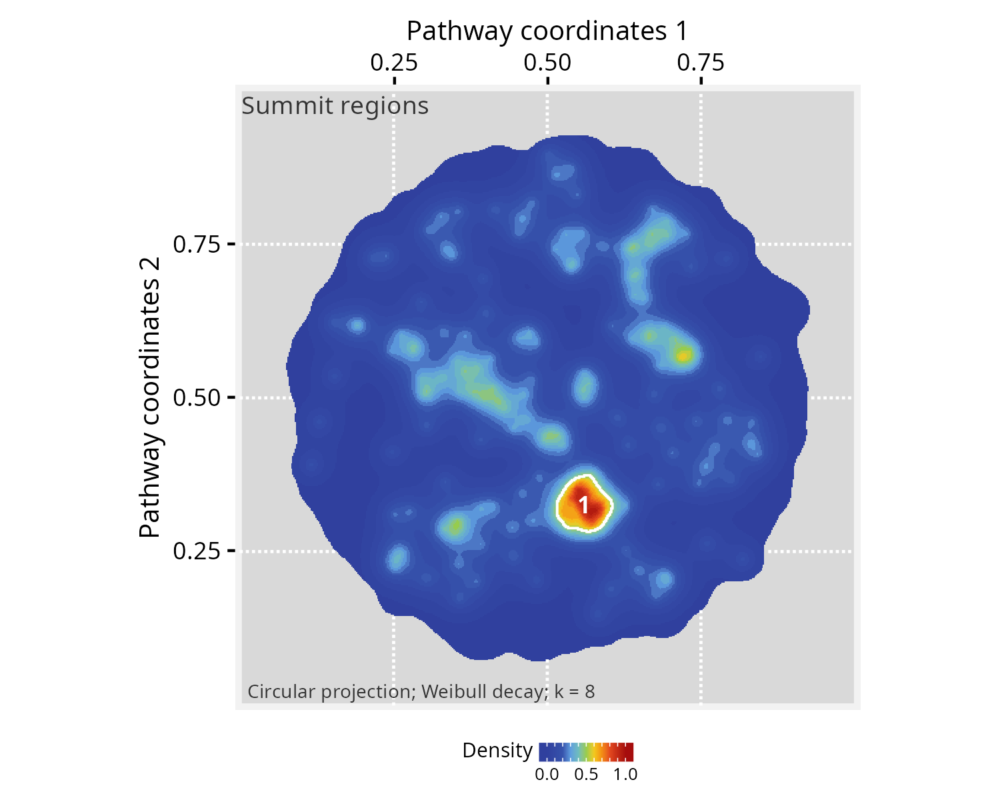

# Visualizing sparse feature sets on large graphs

**Package**: PathwaySpace 1.3.1  

## Overview

This tutorial creates a large *PathwaySpace* object with `n = 12990`
vertices, upon which we will project binary signals representing feature
sets from a relatively small number of vertices. The goal is to enhance
clarity and make it less likely for viewers to miss important details of
large graphs when only a limited number of features carry relevant
information. The projections will emphasize clusters of vertices forming
*summits*, and we will add silhouettes as decorative elements to outline
the overall graph structure. The examples in this section are adapted
from Ellrott et al. (2025) and Tercan et al. (2025).

We will start by loading an *igraph* object containing gene interaction
data available from the *Pathway Commons* database (version 12)
(Rodchenkov et al. 2019).

## Required packages

``` r

# Check required packages for this vignette
if (!require("remotes", quietly = TRUE)){
  install.packages("remotes")
}
if (!require("RGraphSpace", quietly = TRUE)){
  remotes::install_github("sysbiolab/RGraphSpace")
}
if (!require("PathwaySpace", quietly = TRUE)){
  remotes::install_github("sysbiolab/PathwaySpace")
}
```

``` r

# Check versions
if (packageVersion("RGraphSpace") < "1.3.1"){
  message("Need to update 'RGraphSpace' for this vignette")
  remotes::install_github("sysbiolab/RGraphSpace")
}
if (packageVersion("PathwaySpace") < "1.3.1"){
  message("Need to update 'PathwaySpace' for this vignette")
  remotes::install_github("sysbiolab/PathwaySpace")
}
```

``` r

# Load packages
library("PathwaySpace")
library("RGraphSpace")
library("igraph")
library("ggplot2")
```

## Setting input data

``` r

# Load a large igraph object
data("PCv12_pruned_igraph", package = "PathwaySpace")

# Check number of vertices
length(PCv12_pruned_igraph)
# [1] 12990

# Check vertex names
head(V(PCv12_pruned_igraph)$name)
# [1] "A1BG" "AKT1" "CRISP3" "GRB2" "PIK3CA" "PIK3R1"

# Get top-connected nodes for visualization
top10hubs <- igraph::degree(PCv12_pruned_igraph)
top10hubs <- names(sort(top10hubs, decreasing = TRUE)[1:10])
head(top10hubs)
# [1] "GNB1" "TRIM28" "RPS27A" "CTNNB1" "TP53" "ACTB"
```

``` r

## Check graph validity
g_space_PCv12 <- GraphSpace(PCv12_pruned_igraph)
# Normalize node coordinates
g_space_PCv12 <- normalizeGraphSpace(g_space_PCv12)
```

``` r

## Visualize the graph layout labeled with 'top10hubs' nodes
plotGraphSpace(g_space_PCv12, 
  node.labels = top10hubs, 
  label.color = "blue", 
  theme = "th3")
```



We now load gene sets from the *MSigDB* collection (Liberzon et al.
2015), which are subsequently used to project a binary signal onto the
*PathwaySpace* image.

``` r

# Load a list with Hallmark gene sets
data("Hallmarks_v2023_1_Hs_symbols", package = "PathwaySpace")

# There are 50 gene sets in "hallmarks"
length(hallmarks)
# [1] 50

# We will use the 'HALLMARK_P53_PATHWAY' (n=200 genes) for demonstration
length(hallmarks$HALLMARK_P53_PATHWAY)
# [1] 200
```

## Running *PathwaySpace*

We now follow the *PathwaySpace* pipeline as explained in the
[introductory
vignette](https://github.com/sysbiolab/PathwaySpace/articles/projection-methods.md),
that is, using the
[`buildPathwaySpace()`](https://github.com/sysbiolab/PathwaySpace/reference/buildPathwaySpace.md)
constructor to initialize a new *PathwaySpace* object with the *Pathway
Commons* interactions.

``` r

# Run the PathwaySpace constructor
p_space_PCv12 <- buildPathwaySpace(gs = g_space_PCv12, nrc = 500)
# Note: 'nrc' sets the number of rows and columns of the
# image space, which will affect the image resolution (in pixels)
```

…and mark the *HALLMARK_P53_PATHWAY* genes in the *PathwaySpace* object.

``` r

# Intersect Hallmark genes with the PathwaySpace
hallmarks <- lapply(hallmarks, intersect, y = names(p_space_PCv12) )

# After intersection, the 'HALLMARK_P53_PATHWAY' dropped to n=173 genes
length(hallmarks$HALLMARK_P53_PATHWAY)
# [1] 173

# Set a binary signal (1s) to 'HALLMARK_P53_PATHWAY' genes
vertexSignal(p_space_PCv12) <- 0
vertexSignal(p_space_PCv12)[ hallmarks$HALLMARK_P53_PATHWAY ] <- 1
```

…and run the
[`circularProjection()`](https://github.com/sysbiolab/PathwaySpace/reference/circularProjection-methods.md)
function.

``` r

# Run signal projection
p_space_PCv12 <- circularProjection(p_space_PCv12)
```

Next, we decorate the *PathwaySpace* image with graph silhouettes and
plot the results.

``` r

# Add silhouettes
p_space_PCv12 <- silhouetteMapping(p_space_PCv12)
# Plot the results
plotPathwaySpace(p_space_PCv12, 
  title = "HALLMARK_P53_PATHWAY", 
  marks = top10hubs, 
  xlab = "Pathway coordinates 1",
  ylab = "Pathway coordinates 2",
  mark.size = 2, theme = "th3")
```


## Mapping summits

The summits represent regions within the graph that exhibit signal
values that are notably higher than the baseline level. These regions
may be of interest for downstream analyses. One potential downstream
analysis is to determine which vertices projected the original input
signal. This could provide insights into communities within these summit
regions. One may also wish to explore other vertices within the summits,
by querying associations with the original input gene set. In order to
extract vertices within summits, next we use the
[`summitMapping()`](https://github.com/sysbiolab/PathwaySpace/reference/summitMapping-methods.md)
function, which also decorates summits with contour lines.

``` r

# Mapping summits
p_space_PCv12 <- summitMapping(p_space_PCv12, minsize = 50)
plotPathwaySpace(p_space_PCv12, 
  title="Summit regions", 
  xlab = "Pathway coordinates 1",
  ylab = "Pathway coordinates 2",
  theme = "th3")
```



``` r

# Extracting summits from a PathwaySpace
summits <- getPathwaySpace(p_space_PCv12, "summits")
class(summits)
# [1] "list"
```

## Citation

If you use *PathwaySpace*, please cite:

- Tercan & Apolonio et al. Protocol for assessing distances in pathway
  space for classifier feature sets from machine learning methods. *STAR
  Protocols* 6(2):103681, 2025.
  <https://doi.org/10.1016/j.xpro.2025.103681>

- Ellrott et al. Classification of non-TCGA cancer samples to TCGA
  molecular subtypes using compact feature sets. *Cancer Cell*
  43(2):195-212.e11, 2025. <https://doi.org/10.1016/j.ccell.2024.12.002>

## Session information

    #> R version 4.6.0 (2026-04-24)
    #> Platform: x86_64-pc-linux-gnu
    #> Running under: Ubuntu 24.04.4 LTS
    #> 
    #> Matrix products: default
    #> BLAS:   /usr/lib/x86_64-linux-gnu/openblas-pthread/libblas.so.3 
    #> LAPACK: /usr/lib/x86_64-linux-gnu/openblas-pthread/libopenblasp-r0.3.26.so;  LAPACK version 3.12.0
    #> 
    #> locale:
    #>  [1] LC_CTYPE=en_US.UTF-8       LC_NUMERIC=C              
    #>  [3] LC_TIME=en_US.UTF-8        LC_COLLATE=en_US.UTF-8    
    #>  [5] LC_MONETARY=en_US.UTF-8    LC_MESSAGES=en_US.UTF-8   
    #>  [7] LC_PAPER=en_US.UTF-8       LC_NAME=C                 
    #>  [9] LC_ADDRESS=C               LC_TELEPHONE=C            
    #> [11] LC_MEASUREMENT=en_US.UTF-8 LC_IDENTIFICATION=C       
    #> 
    #> time zone: America/Sao_Paulo
    #> tzcode source: system (glibc)
    #> 
    #> attached base packages:
    #> [1] stats     graphics  grDevices utils     datasets  methods   base     
    #> 
    #> other attached packages:
    #> [1] igraph_2.3.2       PathwaySpace_1.3.1 RGraphSpace_1.3.1  ggplot2_4.0.3     
    #> [5] remotes_2.5.0     
    #> 
    #> loaded via a namespace (and not attached):
    #>  [1] sass_0.4.10        generics_0.1.4     tidyr_1.3.2        lattice_0.22-9    
    #>  [5] digest_0.6.39      magrittr_2.0.5     evaluate_1.0.5     grid_4.6.0        
    #>  [9] RColorBrewer_1.1-3 fastmap_1.2.0      jsonlite_2.0.0     Matrix_1.7-5      
    #> [13] ggrepel_0.9.8      ggnewscale_0.5.2   ggrastr_1.0.2      purrr_1.2.2       
    #> [17] scales_1.4.0       textshaping_1.0.5  jquerylib_0.1.4    cli_3.6.6         
    #> [21] rlang_1.2.0        tidygraph_1.3.1    withr_3.0.2        RANN_2.6.2        
    #> [25] cachem_1.1.0       yaml_2.3.12        otel_0.2.0         ggbeeswarm_0.7.3  
    #> [29] tools_4.6.0        dplyr_1.2.1        colorspace_2.1-2   vctrs_0.7.3       
    #> [33] R6_2.6.1           lifecycle_1.0.5    fs_2.1.0           htmlwidgets_1.6.4 
    #> [37] vipor_0.4.7        ragg_1.5.2         pkgconfig_2.0.3    beeswarm_0.4.0    
    #> [41] desc_1.4.3         pkgdown_2.2.0      pillar_1.11.1      bslib_0.11.0      
    #> [45] gtable_0.3.6       Rcpp_1.1.1-1.1     glue_1.8.1         systemfonts_1.3.2 
    #> [49] xfun_0.58          tibble_3.3.1       tidyselect_1.2.1   rstudioapi_0.18.0 
    #> [53] knitr_1.51         farver_2.1.2       patchwork_1.3.2    htmltools_0.5.9   
    #> [57] rmarkdown_2.31     compiler_4.6.0     S7_0.2.2

## References

Ellrott, Kyle, Christopher K Wong, Christina Yau, Mauro A A Castro, et
al. 2025. “Classification of Non-TCGA Cancer Samples to TCGA Molecular
Subtypes Using Compact Feature Sets.” *Cancer Cell* 43 (2): 195–212.
<https://doi.org/10.1016/j.ccell.2024.12.002>.

Liberzon, Arthur, Chet Birger, Helga Thorvaldsdottir, Mahmoud Ghandi,
Jill Mesirov, and Pablo Tamayo. 2015. “The Molecular Signatures Database
(MSigDB) Hallmark Gene Set Collection.” *Cell Systems* 1 (5): 417–25.
<https://doi.org/10.1016/j.cels.2015.12.004>.

Rodchenkov, Igor, Ozgun Babur, Augustin Luna, et al. 2019. “Pathway
Commons 2019 Update: integration, analysis and exploration of pathway
data.” *Nucleic Acids Research* 48 (D1): D489–97.
<https://doi.org/10.1093/nar/gkz946>.

Tercan, Bahar, Victor H Apolonio, Vinicius S Chagas, Christopher K Wong,
et al. 2025. “Protocol for Assessing Distances in Pathway Space for
Classifier Feature Sets from Machine Learning Methods.” *STAR Protocols*
6 (2): 103681.
https://doi.org/<https://doi.org/10.1016/j.xpro.2025.103681>.
