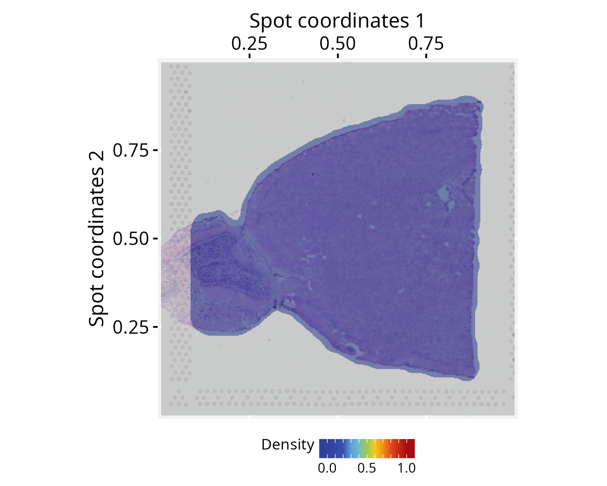
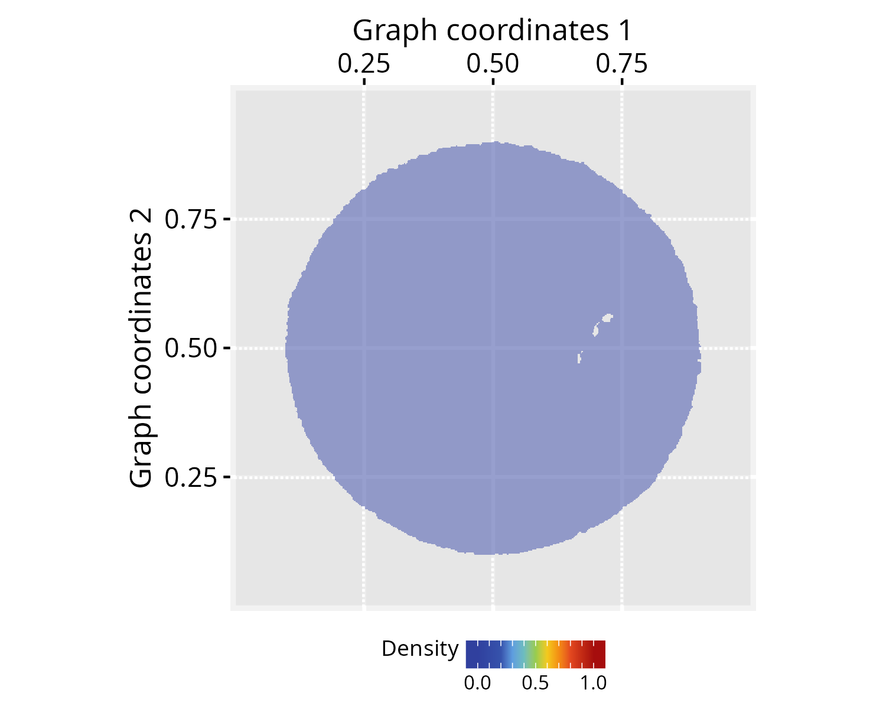
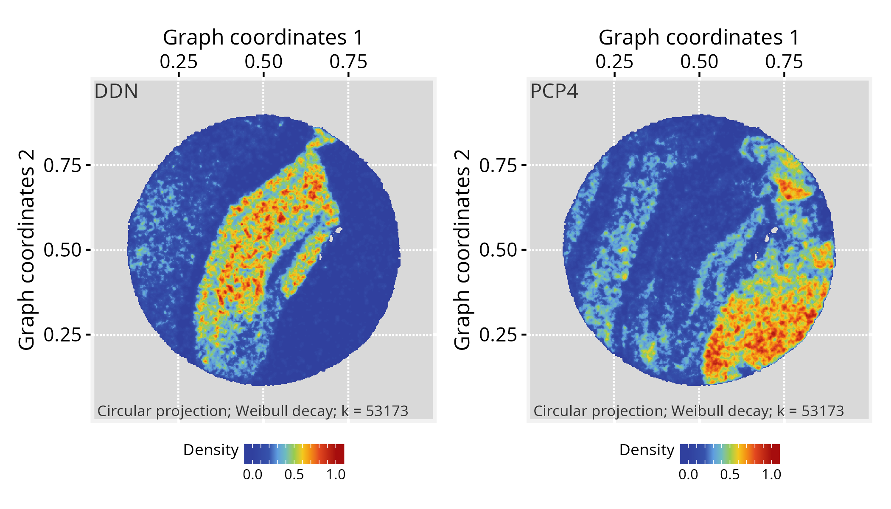
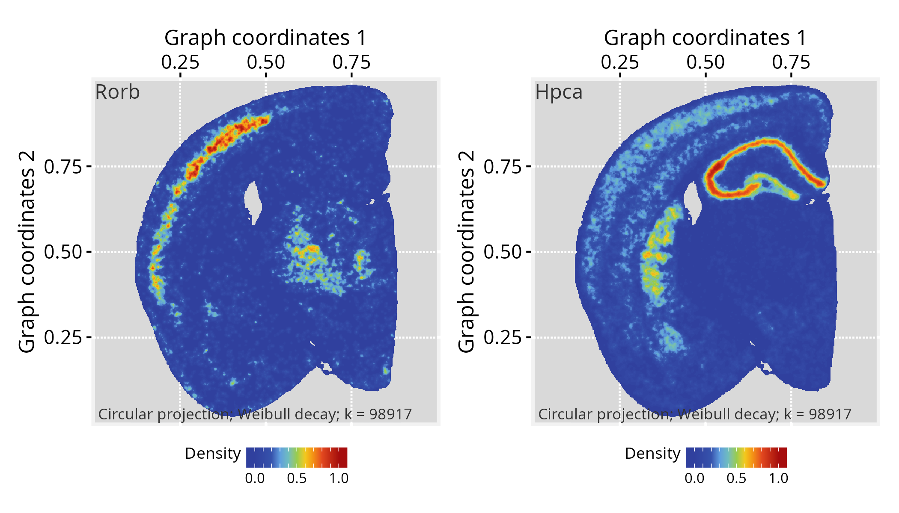

# Visualizing spatial transcriptomics

**Package**: PathwaySpace 1.3.1  

## Overview

This vignette introduces *PathwaySpace* as an extension for the *Seurat*
package (Hao et al. 2024), providing methods for signal propagation and
visualization in spatial transcriptomics. It extends existing spatial
analysis workflows to explore signal patterns in tissue
microenvironments. In what follows, we present three step-by-step
tutorials describing how to prepare input data for *PathwaySpace*. The
results reproduce and refine examples featured in *Seurat*’s tutorials,
so users are encouraged to see how these packages can be used together.

## Before you start

This vignette assumes prior experience with
[*Seurat*](https://satijalab.org/seurat/) (Hao et al. 2024), especially
for handling spatial transcriptomics data.

**Note:**
If you are new to *Seurat*’s spatial workflows, we recommend reviewing
the [spatial analysis
tutorials](https://satijalab.org/seurat/articles/get_started_v5_new#spatial-analysis)
before continuing.

**Computational requirement:**

- Hardware: RAM \>= 16 GB

- Software: R (\>=4.5) and RStudio

## Required packages

``` r

# Check required packages for this vignette
if (!require("remotes", quietly = TRUE)){
  install.packages("remotes")
}
if (!require("RGraphSpace", quietly = TRUE)){
  remotes::install_github("sysbiolab/RGraphSpace")
}
if (!require("PathwaySpace", quietly = TRUE)){
  remotes::install_github("sysbiolab/PathwaySpace")
}
if (!require("Seurat", quietly = TRUE)){
  remotes::install_github("satijalab/seurat-data")
}
if (!require("SeuratData", quietly = TRUE)){
  remotes::install_github("satijalab/seurat-data")
}
if (!require("hdf5r", quietly = TRUE)){
  install.packages("hdf5r")
}
if (!require("arrow", quietly = TRUE)){
  install.packages("arrow")
}
if (!require("BiocManager", quietly = TRUE)){
  install.packages("BiocManager")
}
if (!require("glmGamPoi", quietly = TRUE)){
  BiocManager::install("glmGamPoi")
}
```

``` r

# Check required versions
if (packageVersion("RGraphSpace") < "1.3.1"){
  message("Need to update 'RGraphSpace' for this vignette")
  remotes::install_github("sysbiolab/RGraphSpace")
}
if (packageVersion("PathwaySpace") < "1.3.1"){
  message("Need to update 'PathwaySpace' for this vignette")
  remotes::install_github("sysbiolab/PathwaySpace")
}
if (packageVersion("Seurat") < "5.5.0"){
  message("Need to update 'Seurat' for this vignette")
  remotes::install_github("satijalab/Seurat")
}
```

``` r

# Load packages
library("RGraphSpace")
library("PathwaySpace")
library("Seurat")
library("SeuratObject")
library("SeuratData")
library("patchwork")
```

## Visium v1 dataset

### Setting input data

For this tutorial, we will use the `stxBrain` dataset from the
*SeuratData* package, consisting of spatial transcriptomics data from
sagittal mouse brain sections generated with Visium v1 technology. This
dataset is commonly used to demonstrate *Seurat* spatial workflows (Hao
et al. 2024). Here, we will preprocess it with *Seurat* and then extract
the relevant data for *PathwaySpace* downstream analyses.

``` r

## Install a Seurat dataset (this step is required only once)
SeuratData::InstallData("stxBrain")
```

``` r

# Check manifest of installed datasets
# SeuratData::InstalledData()

# Load the 'stxBrain' dataset
seurat_obj <- LoadData("stxBrain", type = "anterior1")
```

The `stxBrain` dataset is preprocessed following *Seurat*’s [spatial
analysis
workflow](https://satijalab.org/seurat/articles/spatial_vignette),
including variance-stabilizing normalization and cluster annotation.

``` r

# Normalize, reduce dimensions, and annotate clusters
seurat_obj <- SCTransform(seurat_obj, assay = "Spatial", verbose = FALSE)
seurat_obj <- RunPCA(seurat_obj, assay = "SCT", verbose = FALSE)
seurat_obj <- FindNeighbors(seurat_obj, reduction = "pca", dims = 1:30)
seurat_obj <- FindClusters(seurat_obj, verbose = FALSE)
```

… and then
[`as.GraphSpace()`](https://sysbiolab.github.io/RGraphSpace/reference/as.GraphSpace.html)
converts the *Seurat* object into a `GraphSpace`, exposing its spatial
coordinates and feature data to the *ggplot2* grammar. We then attach
the tissue image and normalize node coordinates to the image space.

``` r

# Create a GraphSpace from 'seurat_obj'
gs <- as.GraphSpace(seurat_obj, space = "spatial", scale = "lowres")

# If available, add tissue image 
gs_image(gs) <- SeuratObject::GetImage(seurat_obj, mode = "raster")

# Normalize node coordinates to the image space
# By default, this attempts to align the graph's bottom-up
# coordinates with the image's top-down matrix layout.
gs <- normalizeGraphSpace(gs, use_image = TRUE)
```

In this tutorial we use the low-level *ggplot2* interface for
fine-grained control; the following tutorials demonstrate the
higher-level
[`plotPathwaySpace()`](https://github.com/sysbiolab/PathwaySpace/reference/plotPathwaySpace-methods.md)
wrapper for convenience.

``` r

# Set a reusable theme for spatial plots
spatial_theme <- theme_gspace_coords(theme = "th3", is_norm = TRUE,
  xlab = "Spot coordinates 1", ylab = "Spot coordinates 2")

# Left: 'seurat_clusters' annotation overlaid on tissue image
cpal <- DiscretePalette(nlevels(gs$seurat_clusters), "polychrome")
p1 <- ggplot(gs) + 
  annotation_gspace(gs, opacity = 0.5) +
  geom_nodespace(mapping = aes(fill = seurat_clusters),
    size = 1.2, color = "grey90", stroke = 0.3) +
  scale_fill_manual(values = cpal) +
  theme_gspace_legend(discrete_fill = TRUE) +
  spatial_theme

# Right: Camk2n1 gene expression overlaid on tissue image
cpal <- hcl.colors(100, palette = "Spectral", rev = TRUE)
p2 <- ggplot(gs) + 
  annotation_gspace(gs, opacity = 0.5) +
  geom_nodespace(mapping = aes(colour = Camk2n1), 
    size = 0.8, pch = 19) +
  scale_colour_continuous(palette = cpal) +
  spatial_theme

p1 + p2
```


**Note on image alignment**: Proper spatial alignment between spot
coordinates and the background image requires consistent coordinate
conventions. Spatial misalignment may occur when the input spot
coordinates and image follow origin placements or axis orientations that
differ from the package’s internal coordinate definitions (e.g.,
top-left versus bottom-left origins). To accommodate these differences,
[`normalizeGraphSpace()`](https://sysbiolab.github.io/RGraphSpace/reference/normalizeGraphSpace-methods.html)
provides orientation controls through the `flip.*` and `rotate.*`
arguments. If the spots appear misaligned with the input image, try
alternative combinations of these parameters to correct the alignment.

### Running *PathwaySpace*

Next, we create a *PathwaySpace* object from the spot coordinates.

``` r

# Create a PathwaySpace object
pspace_obj <- buildPathwaySpace(gs)

pspace_obj
# A PathwaySpace-class object for:
# IGRAPH ba090b7 UNW- 2696 0 -- 
# + attr: x (v/n), y (v/n), name (v/c), nodeLabel (v/c), nodeSize (v/n), cell (v/c), orig.ident (v/x),
# | nCount_Spatial (v/n), nFeature_Spatial (v/n), slice (v/n), region (v/c), nCount_SCT (v/n),
# | nFeature_SCT (v/n), SCT_snn_res.0.8 (v/x), seurat_clusters (v/x), signal (v/n), decayFunction
# | (v/x), arrowType (e/n), weight (e/n)
# + features: 17668 (Xkr4, Sox17, Mrpl15, Lypla1, ...)
# + status: Preprocess[x]  Projection[ ]  Silhouette[ ]  Summits[ ]
```

Before projection, we need to specify a distance unit for the signal
decay function. This distance unit will affect the extent over which the
convolution operation projects the signal, scaled to the coordinate
space. We will use the center-to-center distance between spots, which
represents 100 µm in the Visium v1 technology.

``` r

# Get distance to the nearest spot
nspot <- getNearestNode(pspace_obj)
pdist <- mean(nspot$dist) # average distance
# 'pdist' set as the average center-to-center distance between spots
pdist
# [1] 0.013
```

As an optional step, the
[`silhouetteMapping()`](https://github.com/sysbiolab/PathwaySpace/reference/silhouetteMapping-methods.md)
function generates an image mask that outlines the graph layout, over
which the subsequent methods will project a landscape image. The
`baseline` argument controls the level at which a silhouette is sliced
to form the mask. Increasing the baseline (in `[0,1]`) produces a more
detailed, granular silhouette.

``` r

# Add a graph silhouette to the PathwaySpace object
pspace_obj <- silhouetteMapping(pspace_obj, baseline = 0.1)

# Check the silhouette plot
ggplot(pspace_obj) + 
  annotation_gspace_image(pspace_obj) + 
  annotation_pspace_signal(pspace_obj, si.alpha = 0.5) +
  spatial_theme
```



Next, we specify the signal to be projected; for this demonstration, we
will use expression data from the **Camk2n1** gene. The
[`activeFeature()`](https://github.com/sysbiolab/PathwaySpace/reference/vertexSignal-accessors.md)
accessor function is then used to assign the gene expression values to
graph vertices.

``` r

# Set a 'feature' of interest for signal 
# projection (e.g., Camk2n1 genes)
activeFeature(pspace_obj) <- "Camk2n1"
```

We then perform the signal projection, setting `decay = 0.5`. The decay
parameter controls how the signal attenuates as a function of distance
in pathway space. With `decay = 0.5`, the signal decreases to half of
its initial value at a distance equal to `pdist` (for additional
configuration details, see the [*modeling signal
decay*](https://github.com/sysbiolab/PathwaySpace/articles/modeling-signal-decay.md)
tutorial).

``` r

# Project gene signal
pspace_obj <- circularProjection(pspace_obj, k = gs_vcount(pspace_obj), 
  decay.fun = weibullDecay(decay=0.5, pdist = pdist), 
  aggregate.fun = signalAggregation("wmean"))
```

Because each spot produces an independent projection, the resulting
projections are aggregated into a unified landscape. Here we use a
weighted arithmetic mean, with each projection weighted by its own
magnitude (for additional configuration details, see the [*signal
aggregation
rules*](https://github.com/sysbiolab/PathwaySpace/articles/signal-aggregation-rules.md)
tutorial).

Next, we demonstrate the plotting interface with a few variations to
highlight key settings.

``` r

# Left: tissue image only, no signal overlay
p1 <- ggplot(pspace_obj) + 
  annotation_gspace_image(pspace_obj) +
  spatial_theme

# Right: signal overlaid on tissue image with low opacity
p2 <- ggplot(pspace_obj) + 
  annotation_gspace_image(pspace_obj) + 
  annotation_pspace_signal(pspace_obj, si.alpha = 0.5) + 
  spatial_theme

p1 + p2
```


``` r

# Left: signal overlaid on tissue image with low opacity
p2 <- ggplot(pspace_obj) + 
  annotation_gspace_image(pspace_obj) + 
  annotation_pspace_signal(pspace_obj, si.alpha = 0.25) + 
  spatial_theme

# Right: same, with signal truncated to the upper range (zlim >= 0.5)
p3 <- ggplot(pspace_obj) + 
  annotation_gspace_image(pspace_obj) + 
  annotation_pspace_signal(pspace_obj, si.alpha = 0.25, 
    zlim = c(0.5, 1)) + 
  spatial_theme

p2 + p3
```


## Slide-seq v2 dataset

### Setting input data

For this tutorial, we will use the `ssHippo` dataset available from the
*SeuratData* package, consisting of spatial transcriptomics data from
mouse hippocampus generated with **Slide-seq v2 technology**. We will
follow the same general steps from our previous spatial tutorial,
preprocessing with *Seurat* and then extracting the relevant data for
*PathwaySpace* downstream analyses. For further details on this dataset,
see *Seurat*’s
[spatial_vignette](https://satijalab.org/seurat/articles/spatial_vignette.html).

``` r

## Install a Seurat dataset (this step is required only once)
SeuratData::InstallData("ssHippo")
```

``` r

# Check manifest of installed datasets
# SeuratData::InstalledData()

# Load the 'kidneyref' dataset
seurat_obj <- LoadData("ssHippo")
```

``` r

# Run vst normalization on counts
# seurat_obj <- SCTransform(seurat_obj, assay = "Spatial", verbose = FALSE)

# NOTE: Seurat recommends using SCTransform() for processing this 
# spatial dataset, which may require more computation time. Here,
# we use log-normalization for demonstration purposes.
seurat_obj <- NormalizeData(seurat_obj)
```

``` r

# Create a GraphSpace from 'seurat_obj'
gs <- as.GraphSpace(seurat_obj, space = "spatial")

#Note: the `ssHippo` dataset does not include a tissue image

# Normalize node coordinates; 'flip.y' and 'rotate.xy' to 
# follow image orientation in Seurat's vignette
gs <- normalizeGraphSpace(gs, flip.y = TRUE, rotate.xy = TRUE)

# If needed, remove seurat_obj to free memory
# rm(seurat_obj)
```

``` r

# Create a PathwaySpace from the 'gs' object
pspace_obj <- buildPathwaySpace(gs)
```

### Running *PathwaySpace*

``` r

# Get distance to the nearest spot
nspot <- getNearestNode(pspace_obj)
pdist <- mean(nspot$dist) # average distance
# 'pdist' set as the average center-to-center distance between spots
pdist
# [1] 0.0024
```

``` r

# Add a graph silhouette to the PathwaySpace object
pspace_obj <- silhouetteMapping(pspace_obj, fill.cavity = FALSE, 
  pdist = max(nspot$dist))

# Check silhouette plot
plotPathwaySpace(ps=pspace_obj, theme = "th3", si.alpha = 0.5)
```



``` r

# Set a 'feature' of interest for signal 
# projection (e.g., DDN gene)
activeFeature(pspace_obj) <- "DDN"

# Project gene signal
pspace_obj <- circularProjection(pspace_obj, 
  k = gs_vcount(pspace_obj), 
  decay.fun = weibullDecay(decay=0.5, pdist = pdist))

# Plot projections
#-- as a suggestion, truncate zlim at the upper limit 
#-- to enhance certain patters
p1 <- plotPathwaySpace(ps = pspace_obj, theme = "th3")
```

``` r

# Set a 'feature' of interest for signal 
# projection (e.g., PCP4 gene)
activeFeature(pspace_obj) <- "PCP4"

# Project gene signal
pspace_obj <- circularProjection(pspace_obj,
  k = gs_vcount(pspace_obj), 
  decay.fun = weibullDecay(decay=0.5, pdist = pdist))

# Plot projections
p2 <- plotPathwaySpace(ps = pspace_obj, theme = "th3")
```

``` r

p1 + p2
```



## Visium HD dataset

### Setting input data

Here, we will use a higher-resolution spatial dataset from mouse brain
generated with **Visium HD technology**. This platform provides
whole-transcriptome gene expression data at a raw 2-µm resolution, with
additional binned versions available at 8 and 16 µm. For this tutorial,
we will use the 16-µm binned data. We will follow the same general steps
from our previous spatial tutorials, preprocessing with *Seurat* and
then extracting the relevant data for *PathwaySpace* downstream
analyses. For additional details on this dataset, refer to *Seurat*’s
[visiumhd_analysis_vignette](https://satijalab.org/seurat/articles/visiumhd_analysis_vignette.html).

**The Visium HD dataset can be downloaded from the 10x Genomics
repository:**

- Repository URL: <https://www.10xgenomics.com/datasets>
- Dataset: [Visium HD Spatial Gene Expression Library, Mouse Brain
  (FFPE)](https://www.10xgenomics.com/datasets/visium-hd-cytassist-gene-expression-libraries-of-mouse-brain-he)
- Where to find it: Output and supplemental files
- Download: [Binned outputs (all bin
  levels)](https://cf.10xgenomics.com/samples/spatial-exp/3.0.0/Visium_HD_Mouse_Brain/Visium_HD_Mouse_Brain_binned_outputs.tar.gz)
- File: Visium_HD_Mouse_Brain_binned_outputs.tar.gz
- MD5: 2e728d1c1bda99a36535ba45b4319a98
- Size: 4.62 GB

``` r

# Extract the tar.gz and set 'localdir' to the dataset folder
# Use 'bin.size' to choose the data resolution to load (2, 8, or 16 µm)
localdir <- "path/to/data/directory"
seurat_obj <- Load10X_Spatial(data.dir = localdir, bin.size = 16)

# Check default assay
Assays(seurat_obj)
# [1] "Spatial.016um"
```

``` r

# Run log-normalization for spatial data
seurat_obj <- NormalizeData(seurat_obj)
```

``` r

# Create a GraphSpace from 'seurat_obj'
gs <- as.GraphSpace(seurat_obj, space = "spatial", scale = "lowres")

# If available, add tissue image 
gs_image(gs) <- SeuratObject::GetImage(seurat_obj, mode = "raster")

# Normalize node coordinates to the image space
gs <- normalizeGraphSpace(gs, use_image = TRUE)

# If needed, remove seurat_obj to free memory
rm(seurat_obj)
```

``` r

# Create a PathwaySpace object from 'gs' mapped to the 'raster'
pspace_obj <- buildPathwaySpace(gs, nrc = 700)
```

### Running *PathwaySpace*

``` r

# Get distance to the nearest spot
nspot <- getNearestNode(pspace_obj)
pdist <- mean(nspot$dist) # average distance
# 'pdist' set as the average center-to-center distance between spots
pdist
# [1] 0.0024
```

``` r

# Add a graph silhouette to the PathwaySpace object
pspace_obj <- silhouetteMapping(pspace_obj, 
  fill.cavity = FALSE, 
  pdist = max(nspot$dist))

# Check silhouette plot
plotPathwaySpace(ps = pspace_obj, theme = "th3", 
  add.image = TRUE, si.alpha = 0.5)
```


``` r

# Set a 'feature' of interest for signal 
# projection (e.g., Rorb genes)
activeFeature(pspace_obj) <- "Rorb"

# Project gene signal
pspace_obj <- circularProjection(pspace_obj, k = gs_vcount(pspace_obj), 
  decay.fun = weibullDecay(decay=0.5, pdist = pdist))

# Plot projections
p1 <- plotPathwaySpace(pspace_obj, theme = "th3", add.image = TRUE)
```

``` r

# ...another 'feature' (e.g. Hpca genes)
activeFeature(pspace_obj) <- "Hpca"

# Project gene signal
pspace_obj <- circularProjection(pspace_obj, k = gs_vcount(pspace_obj), 
  decay.fun = weibullDecay(decay=0.5, pdist = pdist))

# Plot projections
p2 <- plotPathwaySpace(pspace_obj, theme = "th3", add.image = TRUE)
```

``` r

p1 + p2
```



## Citation

If you use *PathwaySpace*, please cite:

- Tercan & Apolonio et al. Protocol for assessing distances in pathway
  space for classifier feature sets from machine learning methods. *STAR
  Protocols* 6(2):103681, 2025.
  <https://doi.org/10.1016/j.xpro.2025.103681>

- Ellrott et al. Classification of non-TCGA cancer samples to TCGA
  molecular subtypes using compact feature sets. *Cancer Cell*
  43(2):195-212.e11, 2025. <https://doi.org/10.1016/j.ccell.2024.12.002>

## Session information

    #> R version 4.6.0 (2026-04-24)
    #> Platform: x86_64-pc-linux-gnu
    #> Running under: Ubuntu 24.04.4 LTS
    #> 
    #> Matrix products: default
    #> BLAS:   /usr/lib/x86_64-linux-gnu/openblas-pthread/libblas.so.3 
    #> LAPACK: /usr/lib/x86_64-linux-gnu/openblas-pthread/libopenblasp-r0.3.26.so;  LAPACK version 3.12.0
    #> 
    #> locale:
    #>  [1] LC_CTYPE=en_US.UTF-8       LC_NUMERIC=C              
    #>  [3] LC_TIME=en_US.UTF-8        LC_COLLATE=en_US.UTF-8    
    #>  [5] LC_MONETARY=en_US.UTF-8    LC_MESSAGES=en_US.UTF-8   
    #>  [7] LC_PAPER=en_US.UTF-8       LC_NAME=C                 
    #>  [9] LC_ADDRESS=C               LC_TELEPHONE=C            
    #> [11] LC_MEASUREMENT=en_US.UTF-8 LC_IDENTIFICATION=C       
    #> 
    #> time zone: America/Sao_Paulo
    #> tzcode source: system (glibc)
    #> 
    #> attached base packages:
    #> [1] stats     graphics  grDevices utils     datasets  methods   base     
    #> 
    #> other attached packages:
    #>  [1] patchwork_1.3.2           glmGamPoi_1.24.0         
    #>  [3] BiocManager_1.30.27       arrow_24.0.0             
    #>  [5] hdf5r_1.3.12              stxBrain.SeuratData_0.1.2
    #>  [7] ssHippo.SeuratData_3.1.4  pbmc3k.SeuratData_3.1.4  
    #>  [9] SeuratData_0.2.2.9002     Seurat_5.5.0             
    #> [11] SeuratObject_5.4.0        sp_2.2-1                 
    #> [13] PathwaySpace_1.3.1        RGraphSpace_1.3.1        
    #> [15] ggplot2_4.0.3             remotes_2.5.0            
    #> 
    #> loaded via a namespace (and not attached):
    #>   [1] RcppAnnoy_0.0.23            splines_4.6.0              
    #>   [3] later_1.4.8                 tibble_3.3.1               
    #>   [5] polyclip_1.10-7             fastDummies_1.7.6          
    #>   [7] lifecycle_1.0.5             globals_0.19.1             
    #>   [9] lattice_0.22-9              MASS_7.3-65                
    #>  [11] magrittr_2.0.5              plotly_4.12.0              
    #>  [13] sass_0.4.10                 rmarkdown_2.31             
    #>  [15] jquerylib_0.1.4             yaml_2.3.12                
    #>  [17] httpuv_1.6.17               otel_0.2.0                 
    #>  [19] sctransform_0.4.3           spam_2.11-4                
    #>  [21] spatstat.sparse_3.2-0       reticulate_1.46.0          
    #>  [23] cowplot_1.2.0               pbapply_1.7-4              
    #>  [25] RColorBrewer_1.1-3          abind_1.4-8                
    #>  [27] Rtsne_0.17                  GenomicRanges_1.64.0       
    #>  [29] purrr_1.2.2                 BiocGenerics_0.58.1        
    #>  [31] rappdirs_0.3.4              IRanges_2.46.0             
    #>  [33] S4Vectors_0.50.1            ggrepel_0.9.8              
    #>  [35] irlba_2.3.7                 listenv_0.10.1             
    #>  [37] spatstat.utils_3.2-3        goftest_1.2-3              
    #>  [39] RSpectra_0.16-2             spatstat.random_3.5-0      
    #>  [41] fitdistrplus_1.2-6          parallelly_1.47.0          
    #>  [43] pkgdown_2.2.0               codetools_0.2-20           
    #>  [45] DelayedArray_0.38.2         tidyselect_1.2.1           
    #>  [47] farver_2.1.2                matrixStats_1.5.0          
    #>  [49] stats4_4.6.0                spatstat.explore_3.8-1     
    #>  [51] Seqinfo_1.2.0               jsonlite_2.0.0             
    #>  [53] tidygraph_1.3.1             progressr_0.19.0           
    #>  [55] ggridges_0.5.7              survival_3.8-6             
    #>  [57] systemfonts_1.3.2           tools_4.6.0                
    #>  [59] ggnewscale_0.5.2            ragg_1.5.2                 
    #>  [61] ica_1.0-3                   Rcpp_1.1.1-1.1             
    #>  [63] glue_1.8.1                  gridExtra_2.3              
    #>  [65] SparseArray_1.12.2          xfun_0.58                  
    #>  [67] MatrixGenerics_1.24.0       dplyr_1.2.1                
    #>  [69] withr_3.0.2                 fastmap_1.2.0              
    #>  [71] digest_0.6.39               R6_2.6.1                   
    #>  [73] mime_0.13                   textshaping_1.0.5          
    #>  [75] colorspace_2.1-2            scattermore_1.2            
    #>  [77] tensor_1.5.1                spatstat.data_3.1-9        
    #>  [79] tidyr_1.3.2                 generics_0.1.4             
    #>  [81] data.table_1.18.4           httr_1.4.8                 
    #>  [83] htmlwidgets_1.6.4           S4Arrays_1.12.0            
    #>  [85] uwot_0.2.4                  pkgconfig_2.0.3            
    #>  [87] gtable_0.3.6                lmtest_0.9-40              
    #>  [89] S7_0.2.2                    XVector_0.52.0             
    #>  [91] htmltools_0.5.9             dotCall64_1.2              
    #>  [93] scales_1.4.0                Biobase_2.72.0             
    #>  [95] png_0.1-9                   spatstat.univar_3.2-0      
    #>  [97] knitr_1.51                  rstudioapi_0.18.0          
    #>  [99] reshape2_1.4.5              nlme_3.1-169               
    #> [101] cachem_1.1.0                zoo_1.8-15                 
    #> [103] stringr_1.6.0               KernSmooth_2.23-26         
    #> [105] parallel_4.6.0              miniUI_0.1.2               
    #> [107] vipor_0.4.7                 ggrastr_1.0.2              
    #> [109] desc_1.4.3                  pillar_1.11.1              
    #> [111] grid_4.6.0                  vctrs_0.7.3                
    #> [113] RANN_2.6.2                  promises_1.5.0             
    #> [115] beachmat_2.28.0             xtable_1.8-8               
    #> [117] cluster_2.1.8.2             beeswarm_0.4.0             
    #> [119] evaluate_1.0.5              cli_3.6.6                  
    #> [121] compiler_4.6.0              rlang_1.2.0                
    #> [123] crayon_1.5.3                future.apply_1.20.2        
    #> [125] plyr_1.8.9                  fs_2.1.0                   
    #> [127] ggbeeswarm_0.7.3            stringi_1.8.7              
    #> [129] viridisLite_0.4.3           deldir_2.0-4               
    #> [131] assertthat_0.2.1            lazyeval_0.2.3             
    #> [133] spatstat.geom_3.8-1         Matrix_1.7-5               
    #> [135] RcppHNSW_0.7.0              bit64_4.8.2                
    #> [137] future_1.70.0               shiny_1.13.0               
    #> [139] SummarizedExperiment_1.42.0 ROCR_1.0-12                
    #> [141] fontawesome_0.5.3           igraph_2.3.2               
    #> [143] bslib_0.11.0                bit_4.6.0

## References

Hao, Yuhan, Tim Stuart, Madeline H Kowalski, et al. 2024. “Dictionary
Learning for Integrative, Multimodal and Scalable Single-Cell Analysis.”
*Nature Biotechnology* 42 (2): 293–304.
<https://doi.org/10.1038/s41587-023-01767-y>.
