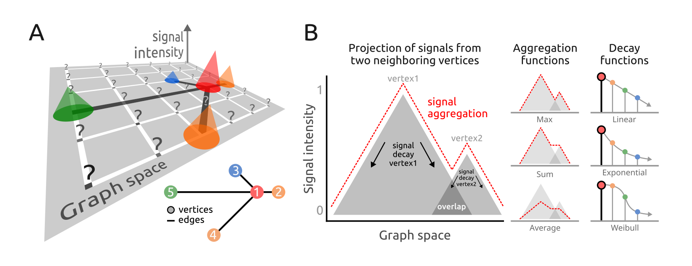

```{r setup, include=FALSE, purl=FALSE}
knitr::opts_chunk$set(echo = TRUE)
```

**Package**: PathwaySpace `r packageVersion('PathwaySpace')`
<br/>

# Highlights
* Produces landscape images representing graphs by geodesic paths.
* Projects signals using a decay function to model signal attenuation.
* Applies a convolution algorithm to combine signals from neighboring vertices.

# Overview

For a given *igraph* object containing vertices, edges, and a signal associated with the vertices, *PathwaySpace* performs a convolution operation, which involves a weighted combination of neighboring signals on a graph. **Figure 1A** illustrates the convolution operation problem. Each vertex's signal is positioned on a grid at specific `x` and `y` coordinates, represented by cones (for available signals) or question marks (for null or missing values).

```{r fig1, echo=FALSE, fig.cap="**Figure 1.** Signal processing addressed by the *PathwaySpace* package. **A**) Graph overlaid on a 2D coordinate system. Each projection cone represents the signal associated with a graph vertex (referred to as *vertex-signal positions*), while question marks indicate positions with no signal information (referred to as *null-signal positions*). **Inset**: Graph layout of the toy example used in the *quick start* section of this vignette. **B**) Illustration of signal projection from two neighboring vertices, simplified to one dimension. **Right**: Signal profiles from aggregation and decay functions.", out.width = '100%', purl=FALSE}

```

<br/>

Our model considers the vertex-signal positions as source points (or transmitters) and the null-signal positions as end points (or receivers). The signal values from vertex-signal positions are then projected to the null-signal positions according to a decay function, which will control how the signal values attenuate as they propagate across the 2D space. For a given null-signal position, the k-top signals are used to define the contributing vertices for the convolution operation, which will aggregate the signals from these contributing vertices considering their intensities reaching the end points. Users can adjust both the aggregation and decay functions; the aggregation function can be any arithmetic rule that reduces a numeric vector into a single scalar value (*e.g.*, mean, weighted mean), while available decay functions include linear, exponential, and Weibull models (**Fig.1B**). Additionally, users can assign vertex-specific decay functions to model signal projections for subsets of vertices that may exhibit distinct behaviors. The resulting image forms geodesic paths in which the signal has been projected from vertex- to null-signal positions, using a density metric to measure the signal intensity along these paths.

# Citation

If you use *PathwaySpace*, please cite:

* Tercan & Apolonio et al. Protocol for assessing distances in pathway space for classifier feature sets from machine learning methods. *STAR Protocols* 6(2):103681, 2025. https://doi.org/10.1016/j.xpro.2025.103681

* Ellrott et al. Classification of non-TCGA cancer samples to TCGA molecular subtypes using compact feature sets. *Cancer Cell* 43(2):195-212.e11, 2025. https://doi.org/10.1016/j.ccell.2024.12.002

# Licenses

The *PathwaySpace* package is distributed under [Artistic-2.0](https://www.r-project.org/Licenses/Artistic-2.0)
