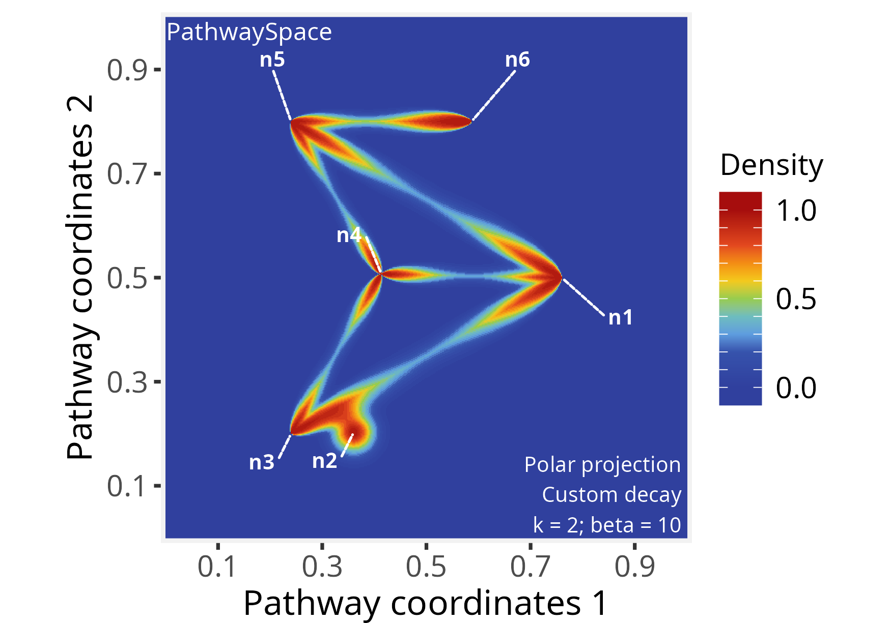
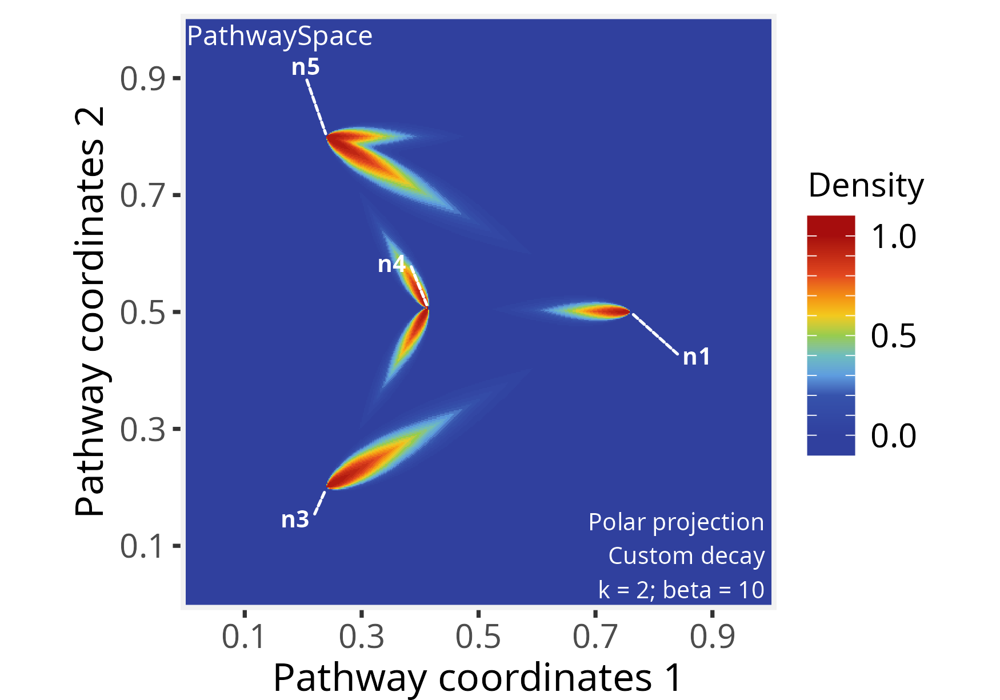

```{r setup, include=FALSE, purl=FALSE}
knitr::opts_chunk$set(echo = TRUE)
```

**Package**: PathwaySpace `r packageVersion('PathwaySpace')`
<br/>

# Overview

In this tutorial, you'll get to know the main *PathwaySpace* methods through simple toy examples. We'll walk through how to set up the input data and run basic graph projections. These examples are designed to give users a feel for the core workflow before diving into larger or real-world datasets.

# Setting basic input data

```{r Load packages - quick start, eval=TRUE, message=FALSE}
#--- Load required packages for this section
library(igraph)
library(ggplot2)
library(RGraphSpace)
library(PathwaySpace)
```

This section will create an *igraph* object containing a binary signal associated to each vertex. The graph layout is configured manually to ensure that users can easily view all the relevant arguments needed to prepare the input data for the *PathwaySpace* package. The *igraph*'s `make_star()` function creates a star-like graph and the `V()` function is used to set attributes for the vertices. The *PathwaySpace* package will require that all vertices have `x`, `y`, and `name` attributes.

```{r Making a toy igraph - 1, eval=TRUE, message=FALSE}
# Make a 'toy' igraph object, either a directed or undirected graph
gtoy1 <- make_star(5, mode="undirected")

# Assign 'x' and 'y' coordinates to each vertex
# ..this can be an arbitrary unit in (-Inf, +Inf)
V(gtoy1)$x <- c(0, 2, -2, -4, -8)
V(gtoy1)$y <- c(0, 0,  2, -4,  0)

# Assign a 'name' to each vertex (here, from n1 to n5)
V(gtoy1)$name <- paste0("n", 1:5)
```

## Checking graph validity

Next, we will create a *GraphSpace-class* object using the `GraphSpace()` constructor. This function will check the validity of the *igraph* object. For this example `mar = 0.2`, which sets the outer margins as a fraction of the 2D space.

```{r GraphSpace constructor - 1, eval=TRUE, message=FALSE}
# Check graph validity
g_space1 <- GraphSpace(gtoy1, mar = 0.2)
```

Our graph is now ready for the *PathwaySpace* package. We can check its layout using the `plotGraphSpace()` function. 

```{r GraphSpace constructor - 2, eval=FALSE, message=FALSE, out.width="100%"}
# Check the graph layout
plotGraphSpace(g_space1, add.labels = TRUE)
```

```{r fig2.png, eval=FALSE, message=FALSE, echo=FALSE, include=FALSE, purl=FALSE}
# gg <- plotGraphSpace(g_space1, add.labels = TRUE)
# ggsave(filename = "./figs_intro/fig2.png", height=4, width=5,
#   units="in", device="png", dpi=250, plot=gg)
```

```{r fig2, echo=FALSE, out.width = '100%', purl=FALSE}
knitr::include_graphics("figs_intro/fig2.png")
```

## Creating a *PathwaySpace* object

Next, we will create a *PathwaySpace-class* object using the `buildPathwaySpace()` constructor. This will calculate pairwise distances between vertices, subsequently required by the signal projection methods.

```{r PathwaySpace constructor - 1, eval=TRUE, message=FALSE}
# Run the PathwaySpace constructor
p_space1 <- buildPathwaySpace(g_space1)
```

As a default behavior, the `buildPathwaySpace()` constructor initializes the signal of each vertex as `0`. We can use the `vertexSignal()` accessor to get and set vertex signals in a *PathwaySpace* object; for example, in order to get vertex names and signal values:

```{r PathwaySpace constructor - 2, eval=TRUE, message=FALSE, results='hide'}
# Check the number of vertices in a PathwaySpace object
gs_vcount(p_space1)
## [1] 5

# Check vertex names
names(p_space1)
## [1] "n1" "n2" "n3" "n4" "n5"

# Check signal (initialized with '0')
vertexSignal(p_space1)
## n1 n2 n3 n4 n5 
##  0  0  0  0  0
```

...and for setting new signal values in the *PathwaySpace* object:

```{r PathwaySpace constructor - 3, eval=TRUE, message=FALSE, results='hide'}
# Set new signal to all vertices
vertexSignal(p_space1) <- c(1, 4, 2, 4, 3)

# Set a new signal to the 1st vertex
vertexSignal(p_space1)[1] <- 2

# Set a new signal to vertex "n1"
vertexSignal(p_space1)["n1"] <- 6

# Check updated signal values
vertexSignal(p_space1)
## n1 n2 n3 n4 n5 
##  6  4  2  4  3
```

# Signal projection

## Circular projection

Following that, we will use the `circularProjection()` function to project the network signals, setting `pdist = 0.4`. This term determines a distance unit for the signal convolution, affecting the extent over which the convolution operation projects the signal. For example, when `pdist = 1`, it will represent the diameter of the inscribed circle within the coordinate space. We also set `k = 1`, which defines the contributing vertices for signal convolution. In this case, each *null-signal position* will receive the projection from a single *vertex-signal position* (*i.e.* the highest signal intensity in pathway space reaching that position). We then create a landscape image using the `plotPathwaySpace()` function.

```{r Circular projection - 1, eval=FALSE, message=FALSE, out.width="70%"}
# Run signal projection
p_space1 <- circularProjection(p_space1, pdist = 0.4, k = 1)

# Plot a PathwaySpace image
plotPathwaySpace(p_space1, add.marks = TRUE)
```

```{r fig3.png, eval=FALSE, message=FALSE, echo=FALSE, include=FALSE, purl=FALSE}
# gg <- plotPathwaySpace(p_space1, add.marks = TRUE)
# ggsave(filename = "./figs_intro/fig3.png", height=3.5, width=5,
#   units="in", device="png", dpi=350, plot=gg)
```

```{r fig3, echo=FALSE, out.width = '100%', purl=FALSE}
knitr::include_graphics("figs_intro/fig3.png")
```

Next, we reassess the same *PathwaySpace* object, using `pdist = 0.2`, `k = 2` and adjusting the `shape` of the decay function, which is passed to the `circularProjection()` function via `decay.fun` argument.

```{r Circular projection - 3, eval=FALSE, message=FALSE, out.width="70%"}
# Re-run signal projection, adjusting Weibull's shape
p_space1 <- circularProjection(p_space1, pdist = 0.2, k = 2, 
  decay.fun = signalDecay(shape = 2))

# Plot PathwaySpace
plotPathwaySpace(p_space1, marks = "n1", theme = "th2")
```

```{r fig4.png, eval=FALSE, message=FALSE, echo=FALSE, include=FALSE, purl=FALSE}
# gg <- plotPathwaySpace(p_space1, marks = "n1", theme = "th2")
# ggsave(filename = "./figs_intro/fig4.png", height=3.5, width=5,
#   units="in", device="png", dpi=350, plot=gg)
```

```{r fig4, echo=FALSE, out.width = '100%', purl=FALSE}
knitr::include_graphics("figs_intro/fig4.png")
```

The `shape` parameter allows a projection to take a variety of shapes. When `shape = 1` the projection follows an exponential decay, and when `shape > 1` the projection is first convex, then concave with an inflection point along the decay path. For additional examples see documentation of the `weibullDecay()` function.

## Polar projection

In this section we will project the network signal using a polar coordinate system. This representation may be useful for certain types of data, for example, to highlight patterns of signal propagation on directed graphs, especially to explore the orientation aspect of signal flow. To demonstrate this feature we will used the `gtoy2` directed graph, available in the *RGraphSpace* package.

```{r Polar projection - 1, eval=TRUE, message=FALSE, out.width="100%"}
# Load a pre-processed directed igraph object
data("gtoy2", package = "RGraphSpace")
# Check graph validity
g_space2 <- GraphSpace(gtoy2, mar = 0.2)
```

```{r Polar projection - 2, eval=FALSE, message=FALSE, out.width="100%"}
# Check the graph layout
plotGraphSpace(g_space2, add.labels = TRUE)
```

```{r fig5.png, eval=FALSE, message=FALSE, echo=FALSE, include=FALSE, purl=FALSE}
# gg <- plotGraphSpace(g_space2, add.labels = TRUE)
# ggsave(filename = "./figs_intro/fig5.png", height=4, width=5,
#   units="in", device="png", dpi=250, plot=gg)
```

```{r fig5, echo=FALSE, out.width = '100%', purl=FALSE}
knitr::include_graphics("figs_intro/fig5.png")
```

```{r Polar projection - 3, eval=TRUE, message=FALSE}
# Build a PathwaySpace for the 'g_space2'
p_space2 <- buildPathwaySpace(g_space2)

# Set '1s' as vertex signal
vertexSignal(p_space2) <- 1
```

For fine-grained modeling of signal decay, the `vertexDecay()` accessor allows assigning decay functions at the level of individual vertices. For example, adjusting Weibull's `shape` argument for node `n6`:

```{r Polar projection - 4, eval=TRUE, message=FALSE}
# Modify decay function
# ..for all vertices
vertexDecay(p_space2) <- signalDecay(shape=2)
# ..for individual vertices
vertexDecay(p_space2)[["n6"]] <- signalDecay(shape=3)
```

Next, we run the signal projection using polar coordinates. The `beta` exponent will control the angular span; for values greater than zero, `beta` will progressively narrow the projection along the edge axis. Also, in the `polarProjection()` function, the `pdist` term will define a distance unit related to edge length, aiming to constrain signal projections within edge bounds. Here we set `pdist = 1` to reach full edge lengths.

```{r Polar projection - 5, eval=FALSE, message=FALSE, out.width="70%"}
# Run signal projection using polar coordinates
p_space2 <- polarProjection(p_space2, pdist = 1, beta = 10)

# Plot PathwaySpace
plotPathwaySpace(p_space2, theme = "th2", add.marks = TRUE)
```

```{r fig6.png, eval=FALSE, message=FALSE, echo=FALSE, include=FALSE, purl=FALSE}
# gg <- plotPathwaySpace(p_space2, theme = "th2", add.marks = TRUE)
# ggsave(filename = "./figs_intro/fig6.png", height=3.5, width=5,
#   units="in", device="png", dpi=350, plot=gg)
```

```{r fig6, echo=FALSE, out.width = '100%', purl=FALSE}

```

Note that this projection distributes signals on the edges regardless of direction. To incorporate edge orientation, we set `directional = TRUE`, which channels the projection along the paths:

```{r Polar projection - 6, eval=FALSE, message=FALSE, out.width="70%"}
# Re-run signal projection using 'directional = TRUE'
p_space2 <- polarProjection(p_space2, pdist = 1, beta = 10, directional = TRUE)

# Plot PathwaySpace
plotPathwaySpace(p_space2, theme = "th2", marks = c("n1","n3","n4","n5"))
```

```{r fig7.png, eval=FALSE, message=FALSE, echo=FALSE, include=FALSE, purl=FALSE}
# gg <- plotPathwaySpace(p_space2, theme = "th2", marks = c("n1","n3","n4","n5"))
# ggsave(filename = "./figs_intro/fig7.png", height=3.5, width=5,
#   units="in", device="png", dpi=350, plot=gg)
```

```{r fig7, echo=FALSE, out.width = '100%', purl=FALSE}

```

This *PathwaySpace* polar projection emphasizes the signal flow along the directional pattern of a directed graph (see the *igraph* plot above). When interpreting, users should note that this approach introduces simplifications; for example, depending on the network topology, the polar projection may fail to capture complex features of directed graphs, such as cyclic dependencies, feedforward and feedback loops, or other intricate interactions.

# Signal types

The *PathwaySpace* accepts binary, integer, and numeric signal types, including `NAs`. If a vertex signal is assigned with `NA`, it will be ignored by the convolution algorithm. Logical values are also allowed, but it will be treated as binary. Next, we show the projection of a signal that includes negative values, using the `p_space1` object created previously.

```{r Signal types, eval=FALSE, message=FALSE, out.width="70%"}
# Set a negative signal to vertices "n3" and "n4"
vertexSignal(p_space1)[c("n3","n4")] <- c(-2, -4)

# Check updated signal vector
vertexSignal(p_space1)
# n1 n2 n3 n4 n5 
#  6  4 -2 -4  3 

# Re-run signal projection
p_space1 <- circularProjection(p_space1, decay.fun = signalDecay(shape = 2))

# Plot PathwaySpace
plotPathwaySpace(p_space1, bg.color = "white", font.color = "grey20", add.marks = TRUE, mark.color = "magenta", theme = "th2")
```

```{r fig8.png, eval=FALSE, message=FALSE, echo=FALSE, include=FALSE, purl=FALSE}
# gg <- plotPathwaySpace(p_space1, bg.color = "white", font.color = "grey20",
#   add.marks = TRUE, mark.color = "magenta", theme = "th2")
# ggsave(filename = "./figs_intro/fig8.png", height=3.5, width=5,
#   units="in", device="png", dpi=350, plot=gg)
```

```{r fig8, echo=FALSE, out.width = '100%', purl=FALSE}
knitr::include_graphics("figs_intro/fig8.png")
```

Note that the original signal vector was rescale to `[-1, +1]`. If the signal vector is `>=0`, then it will be rescaled to `[0, 1]`; if the signal vector is `<=0`, it will be rescaled to `[-1, 0]`; and if the signal vector is in `(-Inf, +Inf)`, then it will be rescaled to `[-1, +1]`. To override this signal processing, simply set `rescale = FALSE` in the projection function.

# Citation

If you use *PathwaySpace*, please cite:

* Tercan & Apolonio et al. Protocol for assessing distances in pathway space for classifier feature sets from machine learning methods. *STAR Protocols* 6(2):103681, 2025. https://doi.org/10.1016/j.xpro.2025.103681

* Ellrott et al. Classification of non-TCGA cancer samples to TCGA molecular subtypes using compact feature sets. *Cancer Cell* 43(2):195-212.e11, 2025. https://doi.org/10.1016/j.ccell.2024.12.002

# Session information
```{r label='Session information', eval=TRUE, echo=FALSE}
sessionInfo()
```


