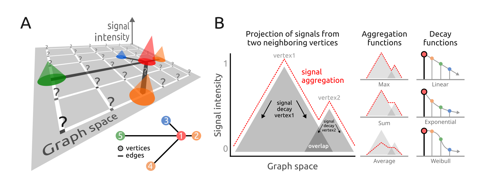

```{r setup, include=FALSE, purl=FALSE}
knitr::opts_chunk$set(echo = TRUE)
```

<br/>
**Package**: PathwaySpace `r packageVersion('PathwaySpace')`

# Highlights
* Produces landscape images with geodesic paths.
* Applies a convolutional algorithm to project signals onto a 2D space.
* Projects signals using decay functions to model signal attenuation.
* Uses k-nearest neighbors to define contributing vertices for signal projection.

# Overview

For a given *igraph* object containing vertices, edges, and a signal associated with the vertices, *PathwaySpace* performs a convolution operation, which involves a weighted combination of neighboring node signals based on the graph structure. **Figure 1** illustrates the convolution operation problem. Each vertex's signal is placed at a specific position in the 2D space. The `x` and `y` coordinates of this space correspond either to vertex-signal positions (*e.g.* red, green, and blue lollipops in **Fig.1A**) or null-signal positions for which no signal information is available (question marks in **Fig.1A**). Our model considers the vertex-signal positions as source points (or transmitters) and the null-signal positions as end points (or receivers). The signal values from vertex-signal positions are then projected to the null-signal positions according to a decay function, which will control how the signal values attenuate as they propagate across the 2D space. Available decay functions include linear, exponential, and Weibull functions (**Fig.1B**). For a given null-signal position, a k-nearest neighbors (kNN) algorithm is used to define the contributing vertices for signal convolution. The convolution operation combines the signals from these contributing vertices, considering their distances and signal strengths, and applies the decay function to model the attenuation of the signal. Users can adjust both the decay function's parameters and the value of k in the kNN algorithm. These parameters control how the signal decays, allowing users to explore different scenarios and observe how varying parameters influence the landscape image. The resulting image forms geodesic paths in which the signal has been projected from vertex- to null-signal positions, using a density metric to measure the signal intensity along these paths.

```{r fig1, echo=FALSE, fig.cap="**Figure 1.** Signal processing addressed by the *PathwaySpace* package. **A**) Representation of a graph superimposed on a 2D coordinate system. Each lollipop icon represents a graph vertex (referred to as vertex-signal positions), while question marks highlight points in the 2D space where no signal information is available (referred to as null-signal positions). **B**) Signal decay profiles of linear, exponential, and Weibull decay functions.", out.width = '90%', purl=FALSE}

```

# Quick start

```{r Load packages - quick start, eval=TRUE, message=FALSE}
#--- Load required packages for this section
library(PathwaySpace)
library(igraph)
library(ggplot2)
```

## Setting basic input data

This section will create an *igraph* object containing a binary signal associated to each vertex. The graph layout is configured manually to ensure that users can easily view all the relevant arguments needed to prepare the input data for the *PathwaySpace* package. The *igraph*'s `make_star()` function creates a star-like graph and the `V()` function is used to set attributes for the vertices. The *PathwaySpace* package will require that all vertices have `x`, `y`, and `name` attributes.

```{r Making a toy igraph - 1, eval=TRUE, message=FALSE}
# Make a 'toy' undirected igraph
gtoy1 <- make_star(5, mode="undirected")

# Assign xy coordinates to each vertex
V(gtoy1)$x <- c(0, 1.5, -4, -4, -9)
V(gtoy1)$y <- c(0, 0,  4, -4,  0)

# Assign a name to each vertex (here, from n1 to n5)
V(gtoy1)$name <- paste0("n", 1:5)
```

Our `gtoy1` graph is now ready for the *PathwaySpace* package. We can check its layout using the `plot.igraph()` function. Alternatively, to lay out and visualize large graphs we suggest the *[RedeR](https://bioconductor.org/packages/RedeR/)* package.

```{r node size, eval=TRUE, message=FALSE, echo=FALSE}
V(gtoy1)$size <- 20
```

```{r Making a toy igraph - 2, eval=FALSE, message=FALSE, out.width="100%"}
# Check the graph layout
plot.igraph(gtoy1)
```

```{r fig2.png, eval=TRUE, message=FALSE, echo=FALSE, include=FALSE, purl=FALSE}
# png(filename = "./figures/fig2.png", pointsize=25, width=1000, height=1000)
# plot.igraph(gtoy1)
# dev.off()
```

```{r fig2, echo=FALSE, out.width = '70%', purl=FALSE}
knitr::include_graphics("figures/fig2.png")
```

## Creating a *PathwaySpace*

Next, we will create a *PathwaySpace-class* object using the `buildPathwaySpace()` constructor. This function will check the validity of the *igraph* object. It will also calculate pairwise distances between vertices, subsequently required by the signal projection methods. Note that for this example we adjusted `mar = 0.2`. This argument sets the outer margins as a fraction of the 2D image space on which the convolution operation will project the signal.

```{r PathwaySpace constructor, eval=TRUE, message=FALSE}
# Run the PathwaySpace constructor
pspace1 <- buildPathwaySpace(gtoy1, mar = 0.2)
```

As a default behavior, the `buildPathwaySpace()` constructor initializes the signal of each vertex as `0`. We can use the `length()`, `names()`, and `vertexSignal()` accessors to get and set vertex signals in the *PathwaySpace* object; for example, in order to get vertex names and signal values:

```{r Setting vertex signal - 1, eval=TRUE, message=FALSE, results='hide'}
# Check the number of vertices in the PathwaySpace object
length(pspace1)
## [1] 5

# Check vertex names
names(pspace1)
## [1] "n1" "n2" "n3" "n4" "n5"

# Check signal (initialized with '0')
vertexSignal(pspace1)
## n1 n2 n3 n4 n5 
##  0  0  0  0  0
```

...and for setting new signal values in *PathwaySpace* objects:

```{r Setting vertex signal - 2, eval=TRUE, message=FALSE, results='hide'}
# Set new signal to all vertices
vertexSignal(pspace1) <- c(1, 3, 2, 3, 2)

# Set a new signal to the 1st vertex
vertexSignal(pspace1)[1] <- 2

# Set a new signal to vertex "n1"
vertexSignal(pspace1)["n1"] <- 4

# Check updated signal values
vertexSignal(pspace1)
## n1 n2 n3 n4 n5 
##  4  3  2  3  2
```

# Signal projection

## Circular projection

Following that, we will use the `circularProjection()` function to project the network signals, using the `weibullDecay()` function with default settings. We set `knn = 1`, defining the contributing vertices for signal convolution. In this case, each *null-signal position* will receive the projection from a single *vertex-signal position* (*i.e.* from the nearest signal source in the pathway space). We then create a landscape image using the `plotPathwaySpace()` function.

```{r Circular projection - 1, eval=FALSE, message=FALSE, out.width="70%"}
# Run network signal projection
pspace1 <- circularProjection(pspace1, knn = 1, pdist = 0.4)

# Plot a PathwaySpace image
plotPathwaySpace(pspace1, marks = TRUE)
```

```{r fig3.png, eval=TRUE, message=FALSE, echo=FALSE, include=FALSE, purl=FALSE}
# gg <- plotPathwaySpace(pspace1, marks = TRUE)
# ggsave(filename = "./figures/fig3.png", height=3.5, width=4.7, 
#   units="in", device="png", dpi=250, plot=gg)
```

```{r fig3, echo=FALSE, out.width = '70%', purl=FALSE}
knitr::include_graphics("figures/fig3.png")
```

The `pdist` term determines a distance unit for the signal convolution related to the pathway space. This distance unit will affect the extent over which the convolution operation projects the signal in the pathway space. Next, we reassess the same *PathwaySpace* object using `knn = 2`. The user can also customize a few arguments in `plotPathwaySpace()` function, which is a wrapper to create dedicated *ggplot* graphics for *PathwaySpace-class* objects. 

```{r Circular projection - 2, eval=FALSE, message=FALSE, out.width="70%"}
# Re-run the network signal projection with 'knn = 2'
pspace1 <- circularProjection(pspace1, knn = 2, pdist = 0.4)

# Plot the PathwaySpace image
plotPathwaySpace(pspace1, marks = c("n3","n4"), theme = "th2")
```

```{r fig4.png, eval=TRUE, message=FALSE, echo=FALSE, include=FALSE, purl=FALSE}
# gg <- plotPathwaySpace(pspace1, marks = c("n3","n4"), theme = "th2")
# ggsave(filename = "./figures/fig4.png", height=3.5, width=4.7,
#   units="in", device="png", dpi=250, plot=gg)
```

```{r fig4, echo=FALSE, out.width = '70%', purl=FALSE}
knitr::include_graphics("figures/fig4.png")
```

The decay function used in the signal projection was passed to the `circularProjection()` function by the `decay_fun` argument. The user can pass additional arguments to the decay function using the `...` argument, for example:

```{r Circular projection - 3, eval=FALSE, message=FALSE, out.width="70%"}
# Re-run the network signal projection, passing 'shape' to the decay function
pspace1 <- circularProjection(pspace1, knn = 2, pdist = 0.2, shape = 2)

# Plot the PathwaySpace image
plotPathwaySpace(pspace1, marks = "n1", theme = "th2")
```

```{r fig5.png, eval=TRUE, message=FALSE, echo=FALSE, include=FALSE, purl=FALSE}
# gg <- plotPathwaySpace(pspace1, marks = "n1", theme = "th2")
# ggsave(filename = "./figures/fig5.png", height=3.5, width=4.7,
#   units="in", device="png", dpi=250, plot=gg)
```

```{r fig5, echo=FALSE, out.width = '75%', purl=FALSE}
knitr::include_graphics("figures/fig5.png")
```

In this case, we set the `shape` of a 3-parameter Weibull function. This parameter allows a projection to take a variety of shapes. When `shape = 1` the Weibull decay follows an exponential decay, and when `shape > 1` the projection is first convex, then concave with an inflexion point along the decay path.

## Polar projection

In this section we will project the network signal using a polar coordinate system. This representation may be useful for certain types of data, for example, to highlight patterns of signal propagation on directed graphs, especially to explore the orientation aspect of signal flow. To demonstrate this feature we will used the `gtoy2` directed graph, already available in the *PathwaySpace* package.

```{r Polar projection - 1, eval=TRUE, message=FALSE, out.width="100%"}
# Load a pre-processed directed igraph object
data("gtoy2", package = "PathwaySpace")
```

```{r Polar projection - 2, eval=FALSE, message=FALSE, out.width="100%"}
# Check the graph layout
plot.igraph(gtoy2)
```

```{r fig6.png, eval=TRUE, message=FALSE, echo=FALSE, include=FALSE, purl=FALSE}
# png(filename = "./figures/fig6.png", pointsize=50, width=1600, height=1600)
# plot.igraph(gtoy2)
# dev.off()
```

```{r fig6, echo=FALSE, out.width = '70%', purl=FALSE}
knitr::include_graphics("figures/fig6.png")
```

```{r Polar projection - 3, eval=TRUE, message=FALSE}
# Build a PathwaySpace for the 'gtoy2' igraph
pspace2 <- buildPathwaySpace(gtoy2, mar = 0.2)

# Set '1s' as vertex signal
vertexSignal(pspace2) <- 1
```

```{r Polar projection - 4, eval=FALSE, message=FALSE, out.width="70%"}
# Run the network signal projection using polar coordinates
pspace2 <- polarProjection(pspace2, knn = 2, theta = 45, shape = 2)

# Plot the PathwaySpace image
plotPathwaySpace(pspace2, theme = "th2", marks = TRUE)
```

```{r fig7.png, eval=TRUE, message=FALSE, echo=FALSE, include=FALSE, purl=FALSE}
# gg <- plotPathwaySpace(pspace2, theme = "th2", marks = TRUE)
# ggsave(filename = "./figures/fig7.png", height=3.5, width=4.7,
#   units="in", device="png", dpi=250, plot=gg)
```

```{r fig7, echo=FALSE, out.width = '75%', purl=FALSE}
knitr::include_graphics("figures/fig7.png")
```

Note that this projection emphasizes signals along the edges of the network. In order to also consider the direction of edges, next we set `directional = TRUE`.

```{r Polar projection - 6, eval=FALSE, message=FALSE, out.width="70%"}
# Re-run the network signal projection using 'directional = TRUE'
pspace2 <- polarProjection(pspace2, knn = 2, theta = 45, shape = 2, 
  directional = TRUE)

# Plot the PathwaySpace image
plotPathwaySpace(pspace2, theme = "th2", marks = c("n1","n3","n4","n5"))
```

```{r fig8.png, eval=TRUE, message=FALSE, echo=FALSE, include=FALSE, purl=FALSE}
# gg <- plotPathwaySpace(pspace2, theme = "th2", marks = c("n1","n3","n4","n5"))
# ggsave(filename = "./figures/fig8.png", height=3.5, width=4.7,
#   units="in", device="png", dpi=250, plot=gg)
```

```{r fig8, echo=FALSE, out.width = '75%', purl=FALSE}
knitr::include_graphics("figures/fig8.png")
```

This updated *PathwaySpace* polar projection emphasizes the signal flow into a defined direction (see the directional pattern of the *igraph* plot at the top of this section). However, when interpreting the results, users must be aware that this method may introduce distortions. For example, depending on the network's structure, the polar projection may not capture all aspects of a directed graph, such as cyclic dependencies, feedforward and feedback loops, or other intricate edge interplays.

## Signal types

The *PathwaySpace* accepts binary, integer, and numeric signal types, including `NAs`. When a vertex is assigned with `NA`, it will be excluded from the signal projection, not evaluated by the convolution algorithm. Logical values are also allowed, but it will be treated as binary. Next, we show the projection of a signal that includes negative values, using the `pspace1` object created previously.

```{r Signal types, eval=FALSE, message=FALSE, out.width="70%"}
# Set a negative signal to vertices "n3" and "n4"
vertexSignal(pspace1)[c("n3","n4")] <- c(-2, -4)

# Check updated signal vector
vertexSignal(pspace1)
# n1 n2 n3 n4 n5 
#  4  3 -2 -4  2 

# Re-run the network signal projection
pspace1 <- circularProjection(pspace1, knn = 2, shape = 2)

# Plot the PathwaySpace image
plotPathwaySpace(pspace1, bg.color = "white", font.color = "grey20",
  marks = TRUE, mark.color = "magenta", theme = "th2")
```

```{r fig9.png, eval=TRUE, message=FALSE, echo=FALSE, include=FALSE, purl=FALSE}
# gg <- plotPathwaySpace(pspace1, bg.color = "white", font.color = "grey20",
#   marks = TRUE, mark.color = "magenta", theme = "th2")
# ggsave(filename = "./figures/fig9.png", height=3.5, width=4.7,
#   units="in", device="png", dpi=250, plot=gg)
```

```{r fig9, echo=FALSE, out.width = '75%', purl=FALSE}
knitr::include_graphics("figures/fig9.png")
```

Note that the original signal vector was rescale to `[-1, +1]`. If the signal vector is `>=0`, then it will be rescaled to `[0, 1]`; if the signal vector is `<=0`, it will be rescaled to `[-1, 0]`; and if the signal vector is in `(-Inf, +Inf)`, then it will be rescaled to `[-1, +1]`. To override this signal processing, simply set the `rescale` argument to `FALSE` in the projection functions.


# *PathwaySpace* decoration

In order to enhance clarity and make it less likely for viewers to miss important details of large graphs, in this section we introduce visual elements to large *PathwaySpace* images. We will use an *igraph* object with `n = 12990` vertices to create a large *PathwaySpace* object, upon which we will project binary signals from a relatively small number of vertices. This example will emphasize clusters of vertices forming *summits*, but it might also come at the cost of reduced clarity in displaying the graph's overall structure, particularly in regions far from the summit areas. In order to balance between emphasizing clusters and maintaining the visibility of the entire graph structure, we will outline graph silhouettes as decoration elements in the *PathwaySpace* image.

```{r Load packages - case study, eval=FALSE, message=FALSE}
#--- Load required packages for this section
library(PathwaySpace)
library(RGraphSpace)
library(igraph)
library(ggplot2)
```

## Loading a large graph

Next, we will load an *igraph* object with `n = 12990` vertices, containing gene interaction data available from the *Pathway Commons* database (version 12) [@Rodchenkov2019].

```{r PathwaySpace decoration - 1, eval=TRUE, message=FALSE, results='hide'}
# Load a large igraph object
data("PCv12_pruned_igraph", package = "PathwaySpace")

# Check number of vertices
length(PCv12_pruned_igraph)
# [1] 12990

# Check vertex names
head(V(PCv12_pruned_igraph)$name)
# [1] "A1BG" "AKT1" "CRISP3" "GRB2" "PIK3CA" "PIK3R1"

# Get top-connected nodes for visualization
top10hubs <- igraph::degree(PCv12_pruned_igraph)
top10hubs <- names(sort(top10hubs, decreasing = TRUE)[1:10])
head(top10hubs)
# [1] "GNB1" "TRIM28" "RPS27A" "CTNNB1" "TP53" "ACTB"
```

Depending on the graphics devices available in the current *R* session, rendering a large graph can take a while. To visualize the graph layout, next we use the `plotGraphSpace()` function from the *RGraphSpace* package for plotting optimization.

```{r PathwaySpace decoration - 2, eval=FALSE, message=FALSE}
## Visualize the graph layout labeled with 'top10hubs' nodes
plotGraphSpace(PCv12_pruned_igraph, marks = top10hubs, 
  mark.color = "blue", theme = "th3")
```

```{r fig10.png, eval=TRUE, message=FALSE, echo=FALSE, include=FALSE, purl=FALSE}
# gg <- plotGraphSpace(PCv12_pruned_igraph, marks = top10hubs,
# mark.color = "blue",  theme = "th3", mark.size = 2)
# ggsave(filename = "./figures/fig10.png", height=4, width=5,
#   units="in", device="png", dpi=200, plot=gg)
```

```{r fig10, echo=FALSE, out.width = '70%', purl=FALSE}
knitr::include_graphics("figures/fig10.png")
```


We will also load gene sets from the *MSigDB* collection [@Liberzon2015], which are subsequently used to project a binary signal in the *PathwaySpace* image.

```{r PathwaySpace decoration - 3, eval=FALSE, message=FALSE}
# Load a list with Hallmark gene sets
data("Hallmarks_v2023_1_Hs_symbols", package = "PathwaySpace")

# There are 50 gene sets in "hallmarks"
length(hallmarks)
# [1] 50

# We will use the 'HALLMARK_P53_PATHWAY' (n=200 genes) for demonstration
length(hallmarks$HALLMARK_P53_PATHWAY)
# [1] 200
```

## Running *PathwaySpace*

We now follow the *PathwaySpace* pipeline as explaned in the previous sections, that is, using the `buildPathwaySpace()` constructor to initialize a new *PathwaySpace* object with the *Pathway Commons* interactions.

```{r PathwaySpace decoration - 4, eval=FALSE, message=FALSE}
# Run the PathwaySpace constructor
pspace_PCv12 <- buildPathwaySpace(g=PCv12_pruned_igraph, nrc=500)
# Note: 'nrc' sets the number of rows and columns of the
# image space, which will affect the image resolution (in pixels)
```

...and now we mark the *HALLMARK_P53_PATHWAY* genes in the *PathwaySpace* object.

```{r PathwaySpace decoration - 5, eval=FALSE, message=FALSE}
# Intersect Hallmark genes with the PathwaySpace
hallmarks <- lapply(hallmarks, intersect, y = names(pspace_PCv12) )

# After intersection, the 'HALLMARK_P53_PATHWAY' dropped to n=173 genes
length(hallmarks$HALLMARK_P53_PATHWAY)
# [1] 173

# Set a binary signal (1s) to 'HALLMARK_P53_PATHWAY' genes
vertexSignal(pspace_PCv12) <- 0
vertexSignal(pspace_PCv12)[ hallmarks$HALLMARK_P53_PATHWAY ] <- 1
```

...and run the `circularProjection()` function.

```{r PathwaySpace decoration - 6, eval=FALSE, message=FALSE}
# Run network signal projection
pspace_PCv12 <- circularProjection(pspace_PCv12)
plotPathwaySpace(pspace_PCv12, title="HALLMARK_P53_PATHWAY", 
  marks = top10hubs, mark.size = 2, theme = "th3")
```

```{r fig11.png, eval=FALSE, message=FALSE, echo=FALSE, purl=FALSE}
# gg <- plotPathwaySpace(pspace_PCv12, theme = "th3",
#   title="HALLMARK_P53_PATHWAY", marks = top10hubs,
#   mark.size = 2, font.size = 0.8)
# ggsave(filename = "./figures/fig11.png", plot=gg, height=4,
#   width=5, units="in", device="png", dpi=250)
```

```{r fig11, echo=FALSE, out.width = '80%', purl=FALSE}
knitr::include_graphics("figures/fig11.png")
```

Note that this image emphasizes groups of vertices forming *summits*, but it misses the outline of the graph structure, which faded with the signal that reaches the furthermost points of the network.

## Mapping silhouettes

Next, we will decorate the *PathwaySpace* image with graph's silhouettes.

```{r PathwaySpace decoration - 7, eval=FALSE, message=FALSE}
# Add silhouettes
pspace_PCv12 <- silhouetteMapping(pspace_PCv12)
plotPathwaySpace(pspace_PCv12, title="HALLMARK_P53_PATHWAY", 
  marks = top10hubs, mark.size = 2, theme = "th3")
```

```{r fig12.png, eval=FALSE, message=FALSE, echo=FALSE, purl=FALSE}
# gg <- plotPathwaySpace(pspace_PCv12, theme = "th3", 
#   title="HALLMARK_P53_PATHWAY", marks = top10hubs, 
#   mark.size = 2, font.size = 0.8)
# ggsave(filename = "./figures/fig12.png", plot=gg, height=4,
#   width=5, units="in", device="png", dpi=250)
```

```{r fig12, echo=FALSE, out.width = '80%', purl=FALSE}
knitr::include_graphics("figures/fig12.png")
```

## Mapping summits

The summits represent regions within the graph that exhibit signal values that are notably higher than the baseline level. These regions may be of interest for downstream analyses. One potential downstream analysis is to determine which vertices projected the original input signal. This could provide insights into the communities within these summit regions. One may also wish to explore other vertices within the summits, by querying associations with the original input gene set. In order to extract vertices within summits, next we use the `summitMapping()` function, which also decorate summits with contour lines.

```{r PathwaySpace decoration - 9, eval=FALSE, message=FALSE}
# Mapping summits
pspace_PCv12 <- summitMapping(pspace_PCv12, minsize = 50)
plotPathwaySpace(pspace_PCv12, title="HALLMARK_P53_PATHWAY", theme = "th3")
```

```{r fig13.png, eval=FALSE, message=FALSE, echo=FALSE, purl=FALSE}
# gg <- plotPathwaySpace(pspace_PCv12, title="HALLMARK_P53_PATHWAY", 
#   theme = "th3", font.size = 0.8,)
# ggsave(filename = "./figures/fig13.png", plot=gg, height=4,
#   width=5, units="in", device="png", dpi=250)
```

```{r fig13, echo=FALSE, out.width = '80%', purl=FALSE}
knitr::include_graphics("figures/fig13.png")
```

```{r PathwaySpace decoration - 10, eval=FALSE, message=FALSE}
# Extracting summits from a PathwaySpace
summits <- getPathwaySpace(pspace_PCv12, "summits")
class(summits)
# [1] "list"
```

# Case study

This will be incorporated into the *PathwaySpace* documentation following the acceptance of Ellrott et al. (2023).

# Citation

If you use *PathwaySpace*, please cite:

* The Cancer Genome Atlas Analysis Network. PathwaySpace: Spatial projection of network signals along geodesic paths. R package, 2023.

* Ellrott et al. (under review)

# Other useful links

* Castro MA, Wang X, Fletcher MN, Meyer KB, Markowetz F (2012). "RedeR: R/Bioconductor package for representing modular structures, nested networks and multiple levels of hierarchical associations." *Genome Biology*, 13(4), R29. 
https://bioconductor.org/packages/RedeR/

* Cardoso MA, Rizzardi LEA, Kume LW, Groeneveld C, Trefflich S, Morais DAA, Dalmolin RJS, Ponder BAJ, Meyer KB, Castro MAA. "TreeAndLeaf: an R/Bioconductor package for graphs and trees with focus on the leaves." *Bioinformatics*, 38(5):1463-1464, 2022. https://bioconductor.org/packages/TreeAndLeaf/

* Csardi G and Nepusz T. "The Igraph Software Package for Complex Network Research." *InterJournal*, ComplexSystems:1695, 2006. https://igraph.org

# Session information
```{r label='Session information', eval=TRUE, echo=FALSE}
sessionInfo()
```

# References

