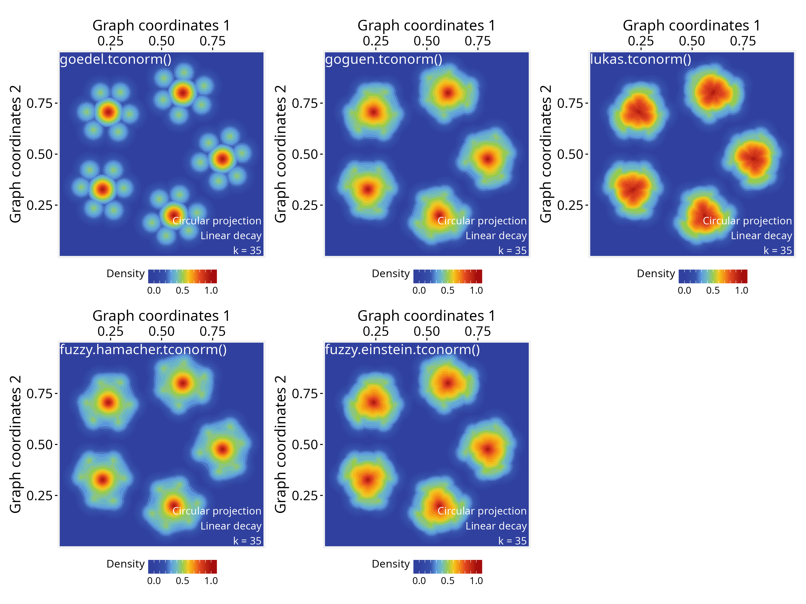

```{r setup, include=FALSE, purl=FALSE}
knitr::opts_chunk$set(
  echo = TRUE,
  collapse = TRUE,
  comment = "#>",
  fig.align = "center",
  fig.width = 7,
  fig.height = 5
  )
```

**Package**: PathwaySpace `r packageVersion('PathwaySpace')`
<br/>

# Overview

When aggregating multiple signals over a space, such as *PathwaySpace* projections, it's often not enough to simply add or average their values, given that each signal carries uncertainty or partial information. 

For practical implementation with *PathwaySpace* projections, any unary aggregation function of the form **`function(x) { ... }`** can be plugged into the pipeline, which has essentially two steps: (i) map raw signal intensities to a decay function, such as linear, exponential, or sigmoidal, depending on the data (see [*modeling signal decay*](modeling-signal-decay.html)); and (ii) use an appropriate operation to produce a combined projection. The decay function models the signal propagation, each vertex emitting a projection that decreases with distance, reflecting both the local strength of the signal and its spatial influence. Because a graph may have multiple vertices, the resulting projections can be aggregated in different ways (see [**Figure 1**](overview.html) for a conceptual overview of signal processing in *PathwaySpace*).

In what follows, this tutorial demonstrates how to create different signal aggregation functions for *PathwaySpace* projections. A toy graph with five small islands is used to illustrate aggregation rules that emphasize distinct patterns in the data. The final section suggests a list of *fuzzy logic* operators that can be used to aggregate signals in *PathwaySpace*, including the trade-offs of each approach.

# Required packages

```{r Check required packages, eval=TRUE, message=FALSE}
# Check required packages for this vignette
if (!require("remotes", quietly = TRUE)){
  install.packages("remotes")
}
if (!require("RGraphSpace", quietly = TRUE)){
  remotes::install_github("sysbiolab/RGraphSpace")
}
if (!require("PathwaySpace", quietly = TRUE)){
  remotes::install_github("sysbiolab/PathwaySpace")
}
```

```{r Check required versions, eval=TRUE, message=FALSE}
# Check versions
if (packageVersion("RGraphSpace") < "1.2.0"){
  message("Need to update 'RGraphSpace' for this vignette")
  remotes::install_github("sysbiolab/RGraphSpace")
}
if (packageVersion("PathwaySpace") < "1.2.0"){
  message("Need to update 'PathwaySpace' for this vignette")
  remotes::install_github("sysbiolab/PathwaySpace")
}
```

```{r Load packages - quick start, eval=TRUE, message=FALSE}
# Load packages
library("igraph")
library("ggplot2")
library("RGraphSpace")
library("PathwaySpace")
library("patchwork")
```

# Setting basic input data

```{r Modeling signal decay - 1, eval=TRUE, message=FALSE}
# Create a simple graph with five islands
g <- rep(igraph::make_star(7, "undirected"), 5)
V(g)$name <- paste0("n",1:vcount(g))
set.seed(123) # for reproducible 'layout_with_fr'
gs <- GraphSpace(g, layout = layout_with_fr(g))
gs <- normalizeGraphSpace(gs)
plotGraphSpace(gs, add.labels = TRUE)
```

```{r Modeling signal decay - 2, eval=TRUE, message=FALSE}
# Build a PathwaySpace object
ps <- buildPathwaySpace(gs)
```

# Assigning a decay model

Next, we will assign a linear decay model for all vertices (for additional details, see the [*modeling signal decay*](modeling-signal-decay.html) tutorial).

```{r Modeling signal decay - 3, eval=TRUE, message=FALSE}
# Get distance to the nearest vertex
near_df <- getNearestNode(ps)
pdist <- mean(near_df$dist)
# 'pdist' set as the average center-to-center distance between vertices
pdist
```

```{r Modeling signal decay - 4, eval=TRUE, message=FALSE}
# Setting a linear decay model for all vertices
vertexDecay(ps) <- linearDecay(pdist = pdist)
```

As a default behavior, the `buildPathwaySpace()` constructor initializes each vertex's signal with `0` (for more details, see the [*signal types*](projection-methods.html#Signal_types) section). We will update this signal, setting peak values at the central vertices or hubs.

```{r Modeling signal decay - 5, eval=TRUE, message=FALSE}
# Find hubs 
hubs <- degree(ps@graph)
hubs <- hubs[hubs>1]
# Add signal
vertexSignal(ps) <- 1
vertexSignal(ps)[names(hubs)] <- 2
# Vertex count
gs_vcount(ps)
```

# Creating aggregation rules

## Means, max, and min

Now we project the signals using the `circularProjection()` function, in which the `aggregate.fun` argument defines the aggregation rule. This argument accepts any user-defined unary aggregation function that aggregates a vector of numeric values into a single scalar output.

In the examples below, we compare two approaches: a standard *arithmetic mean*, where all values contribute equally, and a *self-weighted (contraharmonic) mean*, where each value is weighted by its own magnitude.

```{r Modeling signal decay - 6, eval=TRUE, message=FALSE, out.width="100%"}
# Signal aggregation by 'mean'
ps <- circularProjection(ps, k = gs_vcount(ps), aggregate.fun = mean)
p1 <- plotPathwaySpace(ps, theme = "th3", title = "mean()")

# Signal aggregation by a 'self-weighted mean'
# (generalized contraharmonic to -/+ values)
wmean <- function(x){ weighted.mean(x, abs(x)) }
ps <- circularProjection(ps, k = gs_vcount(ps), aggregate.fun = wmean)
p2 <- plotPathwaySpace(ps, theme = "th3", title = "wmean()")

p1 + p2
```

These examples show how changes in weighting (from equal weights to self-weights) affects the combined projection: The standard *arithmetic mean* may be used when we want to emphasize the influence of local groups, while the *self-weighted mean* will shift the mean toward the more dominant signals.

Next, we assign new aggregation functions to explore different rules. The `max` function also emphasizes the dominant signals while the `min` function will highlight the regions where projections intersect between neighbor vertices.

```{r Modeling signal decay - 7, eval=TRUE, message=FALSE, out.width="100%"}
# Signal aggregation by 'max'
ps <- circularProjection(ps, k = gs_vcount(ps), aggregate.fun = max)
p1 <- plotPathwaySpace(ps, theme = "th3", title = "max()")

# Signal aggregation by 'min'
ps <- circularProjection(ps, k = 2, aggregate.fun = min)
p2 <- plotPathwaySpace(ps, theme = "th3", title = "min()")

p1 + p2
```

Note that the `k` parameter affects the aggregations, as it determines how many projected signals are considered at each point in space. In general, we recommend using `k = gs_vcount(ps)` to capture contributions from all vertices,
except in special cases, such as the example above using the `min` function, where the aggregation aims to highlight minimal values between two neighbor vertices.

## Fuzzy unions and intersections

This section lists *fuzzy logic* functions that can be used to aggregate signals in *PathwaySpace*, mostly available from the *lfl* package [@Burda2021]. A fuzzy intersection measures how strongly all signals agree at a given point, typically using a *t-norm* like minimum or product. A fuzzy union, in contrast, measures how strong any of the signals are at a given point, using a *t-conorm* like maximum. By combining fuzzy unions or intersections with decay functions, we can produce unified projections that integrate multiple signal sources into a single, interpretable representation.

```{r , eval=FALSE}
if (!require("lfl", quietly = TRUE)){
  install.packages("lfl")
}
# Load Fuzzy Logic functions
library(lfl)
```

</br>

### T-norms (Triangular Norms)

These functions represent fuzzy "AND" operations:

```{r , eval=FALSE}
# Goedel t-norm: use when aggregation should be strictly limited by the weakest
# signal (logical AND, conservative intersection);
# Input range in [0, 1]
ps <- circularProjection(ps, k = 2, aggregate.fun = goedel.tnorm)
plotPathwaySpace(ps, theme = "th3")

# Goguen t-norm: use when you want smooth multiplicative attenuation of 
# overlapping signals (probabilistic AND);
# Input range in [0, 1]
ps <- circularProjection(ps, k = 2, aggregate.fun = goguen.tnorm)
plotPathwaySpace(ps, theme = "th3")

# Hamacher product t-norm: use when you need smoothness in signal intersections;
# Input range in [-Inf, Inf];
fuzzy.hamacher.tnorm <- function(x) {
  Reduce(function(a, b) (a * b) / (a + b - a * b), x)
}
ps <- circularProjection(ps, k = 2, aggregate.fun = fuzzy.hamacher.tnorm)
plotPathwaySpace(ps, theme = "th3")

# Einstein product t-norm: use when combining signals should preserve low values
# without collapsing to zero;
# Input range in [-Inf, Inf]
fuzzy.einstein.tnorm <- function(x) {
  Reduce(function(a, b) (a * b) / (1 + (1 - a) * (1 - b)), x)
}
ps <- circularProjection(ps, k = 2, aggregate.fun = fuzzy.einstein.tnorm)
plotPathwaySpace(ps, theme = "th3")
```

```{r , eval=FALSE, message=FALSE, echo=FALSE, include=FALSE, purl=FALSE}
ggps <- list()
ps <- circularProjection(ps, k = 2, aggregate.fun = goedel.tnorm)
ggps$p1 <- plotPathwaySpace(ps, theme = "th3", title = "goedel.tnorm()", font.size=1.3)
ps <- circularProjection(ps, k = 2, aggregate.fun = goguen.tnorm)
ggps$p2 <- plotPathwaySpace(ps, theme = "th3", title = "goguen.tnorm()", font.size=1.3)
ps <- circularProjection(ps, k = 2, aggregate.fun = fuzzy.hamacher.tnorm)
ggps$p3 <- plotPathwaySpace(ps, theme = "th3", title = "fuzzy.hamacher.tnorm()", font.size=1.3)
ps <- circularProjection(ps, k = 2, aggregate.fun = fuzzy.einstein.tnorm)
ggps$p4 <- plotPathwaySpace(ps, theme = "th3", title = "fuzzy.einstein.tnorm()", font.size=1.3)
ggsave(filename = "./figs_intro/fig_b1.png", 
  height=9, width=9, units="in", 
  device="png", dpi=300, 
  plot = wrap_plots(ggps$p1, ggps$p2, ggps$p3, ggps$p4))
```

```{r , echo=FALSE, out.width = '100%', purl=FALSE}
knitr::include_graphics("figs_intro/fig_b1.png")
```

</br>

### T-conorms (Triangular Conorms)

These functions represent fuzzy "OR" operations:

```{r , eval=FALSE}
# Goedel t-conorm: use when you want an extremely permissive OR, where the 
# strongest signal fully dominates the aggregation;
# Input range in [0, 1]
ps <- circularProjection(ps, k = gs_vcount(ps), aggregate.fun = goedel.tconorm)
plotPathwaySpace(ps, theme = "th3")

# Goguen t-conorm: use when overlapping signals should reinforce each other in 
# a probabilistic way (soft OR);
# Input range in  [0, 1]
ps <- circularProjection(ps, k = gs_vcount(ps), aggregate.fun = goguen.tconorm)
plotPathwaySpace(ps, theme = "th3")

# Lukasiewicz t-conorm: use when you want signal reinforcement, saturating at 1 
# once contributions accumulate;
# Input range in [0, 1]
ps <- circularProjection(ps, k = gs_vcount(ps), aggregate.fun = lukas.tconorm)
plotPathwaySpace(ps, theme = "th3")

# Hamacher sum t-conorm: use when you prefer a moderate, nonlinear signal reinforcement 
# that avoids rapid saturation;
# Input range in [0, 1]
fuzzy.hamacher.tconorm <- function(x) {
  stopifnot(is.numeric(x), all(x >= 0), all(x <= 1))
  Reduce(function(a, b) (a + b - 2 * a * b) / (1 - a * b), x)
}
ps <- circularProjection(ps, k = gs_vcount(ps), aggregate.fun = fuzzy.hamacher.tconorm)
plotPathwaySpace(ps, theme = "th3")

# Einstein sum t-conorm: use when signal reinforcement should be smooth and symmetric,
# limiting extreme increases;
# Input range in [-Inf, Inf]
fuzzy.einstein.tconorm <- function(x) {
  Reduce(function(a, b) (a + b) / (1 + a * b), x)
}
ps <- circularProjection(ps, k = gs_vcount(ps), aggregate.fun = fuzzy.einstein.tconorm)
plotPathwaySpace(ps, theme = "th3")
```


```{r , eval=FALSE, message=FALSE, echo=FALSE, include=FALSE, purl=FALSE}
ggps <- list()
ps <- circularProjection(ps, k = gs_vcount(ps), aggregate.fun = goedel.tconorm)
ggps$p1 <- plotPathwaySpace(ps, theme = "th3", title = "goedel.tconorm()", font.size=1.3)
ps <- circularProjection(ps, k = gs_vcount(ps), aggregate.fun = goguen.tconorm)
ggps$p2 <- plotPathwaySpace(ps, theme = "th3", title = "goguen.tconorm()", font.size=1.3)
ps <- circularProjection(ps, k = gs_vcount(ps), aggregate.fun = lukas.tconorm)
ggps$p3 <- plotPathwaySpace(ps, theme = "th3", title = "lukas.tconorm()", font.size=1.3)
ps <- circularProjection(ps, k = gs_vcount(ps), aggregate.fun = fuzzy.hamacher.tconorm)
ggps$p4 <- plotPathwaySpace(ps, theme = "th3", title = "fuzzy.hamacher.tconorm()", font.size=1.3)
ps <- circularProjection(ps, k = gs_vcount(ps), aggregate.fun = fuzzy.einstein.tconorm)
ggps$p5 <- plotPathwaySpace(ps, theme = "th3", title = "fuzzy.einstein.tconorm()", font.size=1.3)

ggsave(filename = "./figs_intro/fig_b2.png", height=9, 
  width=12, units="in", device="png", dpi=300, 
  plot = wrap_plots(ggps$p1, ggps$p2, ggps$p3, ggps$p4, ggps$p5))
```

```{r , echo=FALSE, out.width = '100%', purl=FALSE}

```


Note that most of the fuzzy functions listed above, including *t-norms* (e.g., Goedel, Goguen, Hamacher) and *t-conorms* (e.g., Goedel, Goguen, Lukasiewicz), operate within the unit interval, accepting input values in `[0, 1]`. *PathwaySpace* also operate on this range of values for positive signals by default (with `rescale = TRUE`; see `circularProjection()` function); however, negative signals are rescaled to `[-1, 0]`, and therefore are not directly compatible with these fuzzy operators (for more details, see the [*signal types*](projection-methods.html#Signal_types) section).

Also, when evaluating input signals in the range `(-Inf, Inf)` (*e.g.*, differential expression values), we recommend using aggregation functions that treat negative and positive values symmetrically. In such cases, the standard *arithmetic mean* and *self-weighted mean* provide compatible sign-symmetric aggregation strategies.


# Session information
```{r label='Session information', eval=TRUE, echo=FALSE}
sessionInfo()
```


# References

