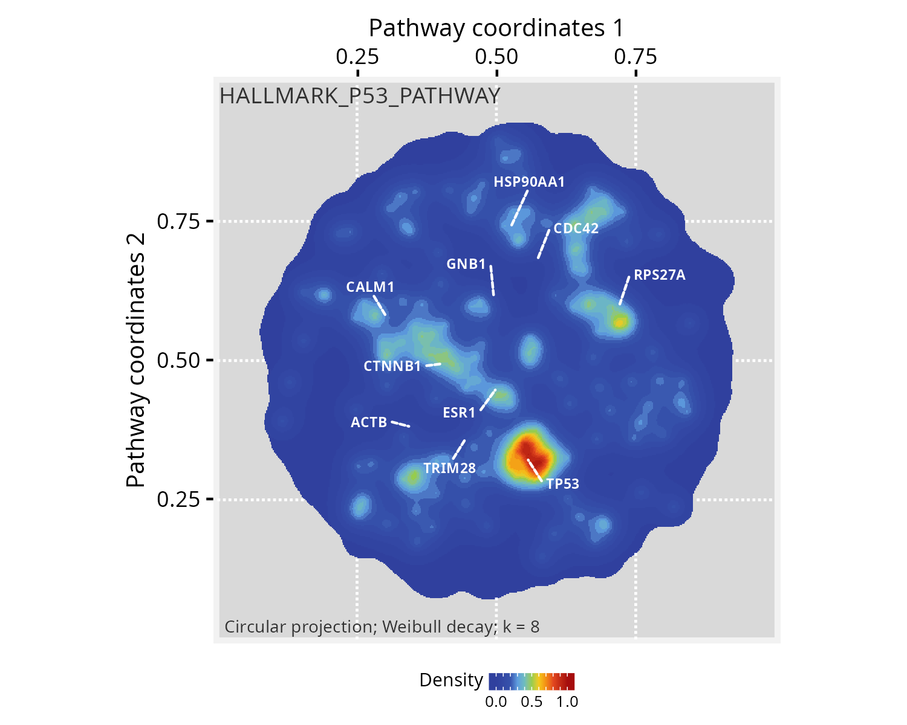

```{r setup, include=FALSE, purl=FALSE}
knitr::opts_chunk$set(
  echo = TRUE,
  collapse = TRUE,
  comment = "#>",
  fig.align = "center",
  fig.width = 5,
  fig.height = 5,
  out.width = "80%"
  )
local_build <- FALSE
```

**Package**: PathwaySpace `r packageVersion('PathwaySpace')`
<br/>

# Overview

This tutorial creates a large *PathwaySpace* object with `n = 12990` vertices, upon which we will project binary signals representing feature sets from a relatively small number of vertices. The goal is to enhance clarity and make it less likely for viewers to miss important details of large graphs when only a limited number of features carry relevant information. The projections will emphasize clusters of vertices forming *summits*, and we will add silhouettes as decorative elements to outline the overall graph structure. The examples in this section are adapted from @Ellrott2025 and @Tercan2025.

We will start by loading an *igraph* object containing gene interaction data available from the *Pathway Commons* database (version 12) [@Rodchenkov2019].

# Required packages

`r fontawesome::fa("exclamation-triangle", fill = "orange")` Before proceeding, ensure that all packages described in the [*Installation Instructions*](install.html) are installed.

```{r Check required versions, eval=TRUE, message=FALSE}
# Check versions
if (packageVersion("RGraphSpace") < "1.4.1"){
  message("Need to update 'RGraphSpace' for this vignette")
  remotes::install_github("sysbiolab/RGraphSpace")
}
if (packageVersion("PathwaySpace") < "1.4.0"){
  message("Need to update 'PathwaySpace' for this vignette")
  remotes::install_github("sysbiolab/PathwaySpace")
}
```

```{r Load packages - case study, eval=TRUE, message=FALSE}
# Load packages
library("PathwaySpace")
library("RGraphSpace")
library("igraph")
library("ggplot2")
```

# Setting input data

```{r PathwaySpace decoration - 1, eval=TRUE, message=FALSE}
# Load a large igraph object
data("PCv12_pruned_igraph", package = "PathwaySpace")

# Check number of vertices (n = 12990)
vcount(PCv12_pruned_igraph)

# Check vertex names ("A1BG", "AKT1", "CRISP3", ...)
head(V(PCv12_pruned_igraph)$name)

# Get top-connected nodes for visualization
top10hubs <- igraph::degree(PCv12_pruned_igraph)
top10hubs <- names(sort(top10hubs, decreasing = TRUE)[1:10])

# Check hubs ("GNB1", "TRIM28", "RPS27A", "CTNNB1", ...)
head(top10hubs)
```

```{r PathwaySpace decoration - 2, eval=TRUE, message=FALSE}
## Check graph validity
g_space_PCv12 <- GraphSpace(PCv12_pruned_igraph)

# Normalize node coordinates
g_space_PCv12 <- normalizeGraphSpace(g_space_PCv12)
```

```{r PathwaySpace decoration - 3, eval=TRUE, message=FALSE}
## Visualize the graph layout labeled with 'top10hubs' nodes
plotGraphSpace(g_space_PCv12, 
  node.labels = top10hubs, 
  label.color = "blue", 
  theme = "th3")
```

We now load gene sets from the *MSigDB* collection [@Liberzon2015], which are subsequently used to project a binary signal onto the *PathwaySpace* image.

```{r PathwaySpace decoration - 4, eval=TRUE, message=FALSE}
# Load a list with Hallmark gene sets
data("Hallmarks_v2023_1_Hs_symbols", package = "PathwaySpace")

# There are 50 gene sets in "hallmarks"
length(hallmarks)

# We will use the 'HALLMARK_P53_PATHWAY' (n=200 genes) for demonstration
length(hallmarks$HALLMARK_P53_PATHWAY)
```


# Running *PathwaySpace*

We now follow the *PathwaySpace* pipeline as explained in the [introductory vignette](projection-methods.html), that is, using the `buildPathwaySpace()` constructor to initialize a new *PathwaySpace* object with the *Pathway Commons* interactions.

```{r PathwaySpace decoration - 5, eval=TRUE, message=FALSE}
# Run the PathwaySpace constructor
p_space_PCv12 <- buildPathwaySpace(gs = g_space_PCv12, nrc = 500)

# Note: 'nrc' sets the number of rows and columns of the
# image space, which will affect the image resolution (in pixels)
```

...and mark the *HALLMARK_P53_PATHWAY* genes in the *PathwaySpace* object.

```{r PathwaySpace decoration - 6, eval=TRUE, message=FALSE}
# Intersect Hallmark genes with the PathwaySpace
hallmarks <- lapply(hallmarks, intersect, y = names(p_space_PCv12) )

# After intersection, the 'HALLMARK_P53_PATHWAY' dropped to n=173 genes
length(hallmarks$HALLMARK_P53_PATHWAY)

# Set a binary signal (1s) to 'HALLMARK_P53_PATHWAY' genes
vertexSignal(p_space_PCv12) <- 0
vertexSignal(p_space_PCv12)[ hallmarks$HALLMARK_P53_PATHWAY ] <- 1
```

...and run the `circularProjection()` function.

```{r PathwaySpace decoration - 7, eval=TRUE, message=FALSE}
# Run signal projection
p_space_PCv12 <- circularProjection(p_space_PCv12, k = 8)

# Note: 'k' sets the number of vertices contributing to the 
# projection; reducing 'k' will focus the projection on the strongest 
# local signals, filtering out weaker contributions.
```

Next, we decorate the *PathwaySpace* image with graph silhouettes and plot the results.

```{r PathwaySpace decoration - 8, eval=TRUE, message=FALSE}
# Add silhouettes
p_space_PCv12 <- silhouetteMapping(p_space_PCv12)

# Plot the results
plotPathwaySpace(p_space_PCv12, 
  title = "HALLMARK_P53_PATHWAY", 
  marks = top10hubs, 
  xlab = "Pathway coordinates 1",
  ylab = "Pathway coordinates 2",
  mark.size = 2, theme = "th3")
```

```{r fig2.png, eval=FALSE, message=FALSE, echo=FALSE, purl=FALSE}
# gg <- plotPathwaySpace(p_space_PCv12, theme = "th3",
#   xlab = "Pathway coordinates 1", ylab = "Pathway coordinates 2",
#   title="HALLMARK_P53_PATHWAY", marks = top10hubs,
#   mark.size = 2, font.size = 0.8)
# 
# ggsave(filename = "./figs_fsets/fig2.png", plot=gg, height=4,
#   width=5, units="in", device="png", dpi=300)
# 
# ggsave(filename = "./figs_fsets/card1.png", plot=gg, height=4,
#   width=4, units="in", device="png", dpi=200)
```

```{r fig2,  eval=local_build, echo=FALSE, out.width = '100%', purl=FALSE}

```


# Mapping summits

The summits represent regions within the graph that exhibit signal values that are notably higher than the baseline level. These regions may be of interest for downstream analyses. One potential downstream analysis is to determine which vertices projected the original input signal. This could provide insights into communities within these summit regions. One may also wish to explore other vertices within the summits, by querying associations with the original input gene set. In order to extract vertices within summits, next we use the `summitMapping()` function, which also decorates summits with contour lines.

```{r Mapping summits - 1, eval=TRUE, message=FALSE}
# Mapping summits
p_space_PCv12 <- summitMapping(p_space_PCv12, minsize = 50)
plotPathwaySpace(p_space_PCv12, 
  title="Summit regions", 
  xlab = "Pathway coordinates 1",
  ylab = "Pathway coordinates 2",
  theme = "th3")
```

```{r fig3.png, eval=FALSE, message=FALSE, echo=FALSE, purl=FALSE}
# gg <- plotPathwaySpace(p_space_PCv12, title="Summit regions",
#   xlab = "Pathway coordinates 1", ylab = "Pathway coordinates 2",
#   theme = "th3", font.size = 0.8,)
# ggsave(filename = "./figs_fsets/fig3.png", plot=gg, height=4,
#   width=5, units="in", device="png", dpi=300)
```

```{r fig3, eval=local_build, echo=FALSE, out.width = '100%', purl=FALSE}
knitr::include_graphics("figs_fsets/fig3.png")
```

```{r Mapping summits - 2, eval=TRUE, message=FALSE}
# Extracting summits from a PathwaySpace
summits <- getPathwaySpace(p_space_PCv12, "summits")
class(summits)
```


# Citation

If you use *PathwaySpace*, please cite:

* Tercan & Apolonio et al. Protocol for assessing distances in pathway space for classifier feature sets from machine learning methods. *STAR Protocols* 6(2):103681, 2025. https://doi.org/10.1016/j.xpro.2025.103681

* Ellrott et al. Classification of non-TCGA cancer samples to TCGA molecular subtypes using compact feature sets. *Cancer Cell* 43(2):195-212.e11, 2025. https://doi.org/10.1016/j.ccell.2024.12.002


# Session information
```{r label='Session information', eval=TRUE, echo=FALSE}
sessionInfo()
```


# References

