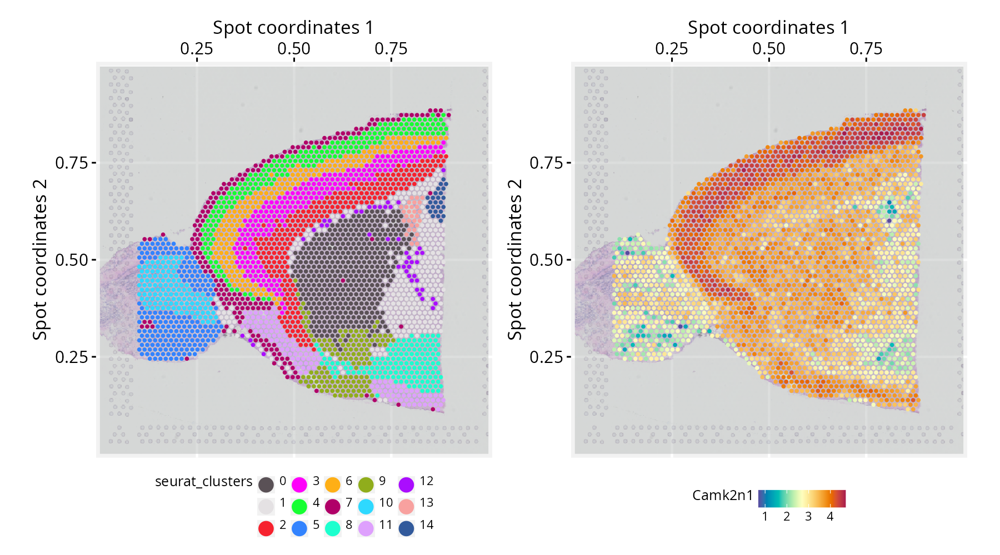
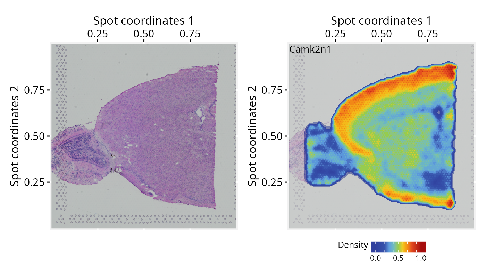
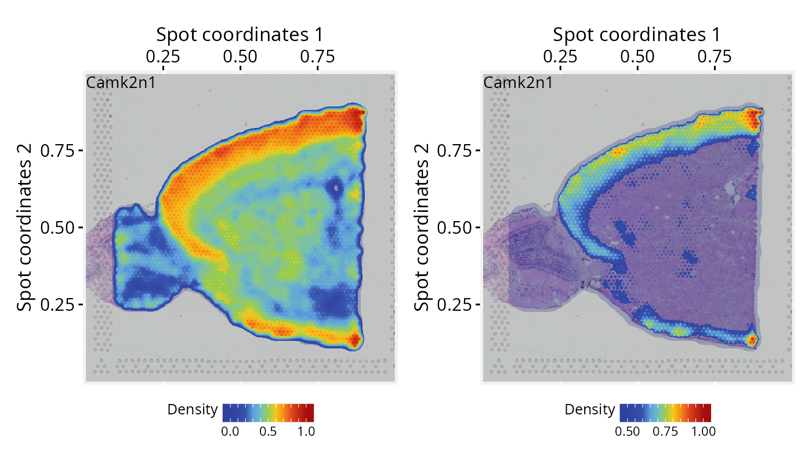
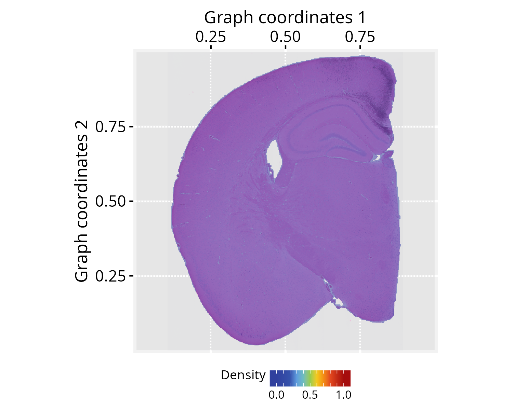

```{r setup, include=FALSE, purl=FALSE}
knitr::opts_chunk$set(
  echo = TRUE,
  collapse = TRUE,
  comment = "#>",
  fig.align = "center"
  )
```

**Package**: PathwaySpace `r packageVersion('PathwaySpace')`
<br/>


# Overview

This vignette introduces *PathwaySpace* as an extension for the *Seurat* package [@Yuhan2024], providing methods for signal projection and visualization in spatial transcriptomics. It extends existing spatial analysis workflows to explore signal patterns in tissue microenvironments. In what follows, we present three step-by-step tutorials describing how to prepare input data for *PathwaySpace*. The results reproduce and refine examples featured in *Seurat*'s tutorials, so users are encouraged to see how these packages can be used together.

# Before you start

This vignette assumes prior experience with [*Seurat*](https://satijalab.org/seurat/){target="_blank" rel="noopener"} [@Yuhan2024], especially for handling spatial transcriptomics data.

`r fontawesome::fa("exclamation-triangle", fill = "orange")` **Note:** If you are new to *Seurat*'s spatial workflows, we recommend reviewing the [spatial analysis tutorials](https://satijalab.org/seurat/articles/get_started_v5_new#spatial-analysis){target="_blank" rel="noopener"} before continuing.

**Computational requirement:**

* Hardware: RAM >= 16 GB

* Software: R (>=4.5) and RStudio

# Required packages

`r fontawesome::fa("exclamation-triangle", fill = "orange")` Ensure that all packages described in the [*Installation Instructions*](install.html) are installed.

```{r Check required versions, eval=TRUE, message=FALSE}
# Check required versions
if (packageVersion("RGraphSpace") < "1.4.1"){
  message("Need to update 'RGraphSpace' for this vignette")
  remotes::install_github("sysbiolab/RGraphSpace")
}
if (packageVersion("PathwaySpace") < "1.4.0"){
  message("Need to update 'PathwaySpace' for this vignette")
  remotes::install_github("sysbiolab/PathwaySpace")
}
if (packageVersion("Seurat") < "5.5.0"){
  message("Need to update 'Seurat' for this vignette")
  remotes::install_github("satijalab/Seurat")
}
```

```{r Load packages, eval=TRUE, message=FALSE}
# Load packages
library("RGraphSpace")
library("PathwaySpace")
library("Seurat")
library("SeuratObject")
library("SeuratData")
library("patchwork")
```


# Visium v1 dataset

## Setting input data

For this tutorial, we will use the `stxBrain` dataset from the *SeuratData* package, consisting of spatial transcriptomics data from sagittal mouse brain sections generated with Visium v1 technology. This dataset is commonly used to demonstrate *Seurat* spatial workflows [@Yuhan2024]. Here, we will preprocess it with *Seurat* and then extract the relevant data for *PathwaySpace* downstream analyses.

```{r Intall dataset, eval=FALSE, message=FALSE, results='hide'}
## Install a Seurat dataset (this step is required only once)
SeuratData::InstallData("stxBrain")
```

```{r Load dataset, eval=FALSE, message=FALSE, results='hide'}
# Check manifest of installed datasets
# SeuratData::InstalledData()

# Load the 'stxBrain' dataset
seurat_obj <- LoadData("stxBrain", type = "anterior1")
```

The `stxBrain` dataset is preprocessed following *Seurat*'s [spatial analysis workflow](https://satijalab.org/seurat/articles/spatial_vignette){target="_blank" rel="noopener"}, including variance-stabilizing normalization and cluster annotation.

```{r Preprocess data, eval=FALSE, message=FALSE, results='hide'}
# Normalize, reduce dimensions, and annotate clusters
seurat_obj <- SCTransform(seurat_obj, assay = "Spatial", verbose = FALSE)
seurat_obj <- RunPCA(seurat_obj, assay = "SCT", verbose = FALSE)
seurat_obj <- FindNeighbors(seurat_obj, reduction = "pca", dims = 1:30)
seurat_obj <- FindClusters(seurat_obj, verbose = FALSE)
```

... and then `as.GraphSpace()` converts the *Seurat* object into a `GraphSpace`, exposing its spatial coordinates and feature data to the *ggplot2* grammar. We then attach the tissue image and normalize node coordinates to the image space.

```{r Extract data, eval=FALSE, message=FALSE, results='hide'}
# Create a GraphSpace from 'seurat_obj'
gs <- as.GraphSpace(seurat_obj, space = "spatial", scale = "lowres")

# If available, add tissue image 
gs_image(gs) <- SeuratObject::GetImage(seurat_obj, mode = "raster")

# Normalize node coordinates to the image space
# By default, this attempts to align the graph's bottom-up
# coordinates with the image's top-down matrix layout.
gs <- normalizeGraphSpace(gs)

gs
# A GraphSpace-class object for:
# IGRAPH 381ac9a UN-- 2696 0 -- 
# + attr: x (v/n), y (v/n), name (v/c), nodeLabel (v/c), nodeSize
# | (v/n), cell (v/c), orig.ident (v/x), nCount_Spatial (v/n),
# | nFeature_Spatial (v/n), slice (v/n), region (v/c), nCount_SCT
# | (v/n), nFeature_SCT (v/n), SCT_snn_res.0.8 (v/x), seurat_clusters
# | (v/x), arrowType (e/n)
# + features: 17668 (Xkr4, Sox17, Mrpl15, Lypla1, ...)
```

In this tutorial we use the low-level *ggplot2* interface for fine-grained control; the subsequent tutorials use the higher-level `plotPathwaySpace()` wrapper for convenience.

```{r Check spots, eval=FALSE, message=FALSE}
# Set a reusable theme for spatial plots
spatial_theme <- theme_gspace_coords(theme = "th3", is_norm = TRUE,
  xlab = "Spot coordinates 1", ylab = "Spot coordinates 2")

# Left: 'seurat_clusters' annotation overlaid on tissue image
cpal1 <- DiscretePalette(nlevels(gs$seurat_clusters), "polychrome")
p1 <- ggplot(gs) + 
  annotation_gspace_image(gs, opacity = 0.5) +
  geom_nodespace(mapping = aes(colour = seurat_clusters), size=0.8, pch=19) +
  scale_colour_discrete(palette = cpal1) +
  theme_gspace_legend(discrete_colour = TRUE) +
  spatial_theme

# Right: Camk2n1 gene expression overlaid on tissue image
cpal2 <- hcl.colors(100, palette = "Spectral", rev = TRUE)
p2 <- ggplot(gs) + 
  annotation_gspace_image(gs, opacity = 0.5) +
  geom_nodespace(mapping = aes(colour = Camk2n1), size=0.8, pch=19) +
  scale_colour_continuous(palette = cpal2) +
  spatial_theme

p1 + p2
```

```{r fig1.png, eval=FALSE, message=FALSE, echo=FALSE, include=FALSE, purl=FALSE}
# ggsave(filename = "./figs_spatl/fig1.png", height=5, width=9,
#   units="in", device="png", dpi=200, plot = p1 + p2)
```

```{r fig1, echo=FALSE, out.width = '100%', purl=FALSE}

```

**Note on image alignment**: Proper spatial alignment between spot coordinates and the background image requires consistent coordinate conventions. Spatial misalignment may occur when the input spot coordinates and image follow origin placements or axis orientations that differ from the package's internal coordinate definitions (e.g., top-left versus bottom-left origins). To accommodate these differences, `normalizeGraphSpace()` provides orientation controls through the `flip.*` and `rotate.*` arguments. If the spots appear misaligned with the input image, try alternative combinations of these parameters to correct the alignment.

## Running *PathwaySpace*

```{r Create a PathwaySpace, eval=FALSE, message=FALSE}
# Create a PathwaySpace object
pspace_obj <- buildPathwaySpace(gs)
```

Before running the projection, we need to specify a distance unit for the signal decay function. This unit will affect the extent over which the signal is projected on the coordinate space. We will use the center-to-center distance between spots, corresponding to 100 µm in Visium v1 technology.

```{r Check spot distances, eval=FALSE, message=FALSE}
# Get distance to the nearest spot
nspot <- getNearestNode(pspace_obj)
pdist <- mean(nspot$dist) # average distance
# 'pdist' is set as the average center-to-center distance between spots
pdist
# [1] 0.013
```

As an optional step, the `silhouetteMapping()` function generates an image mask that outlines the graph layout, over which the subsequent methods will project a landscape image. The `baseline` argument controls the level at which a silhouette is sliced to form the mask. Increasing the baseline (in `[0,1]`) produces a more detailed, granular silhouette.

```{r Add a graph silhouette to PathwaySpace, eval=FALSE, message=FALSE}
# Add a graph silhouette to the PathwaySpace object
pspace_obj <- silhouetteMapping(pspace_obj, baseline = 0.1)

# Check the silhouette plot
ggplot(pspace_obj) + 
  annotation_gspace_image(pspace_obj) + 
  annotation_pspace_signal(pspace_obj, si.alpha = 0.5) +
  spatial_theme
```

```{r fig2.png, eval=FALSE, message=FALSE, echo=FALSE, include=FALSE, purl=FALSE}
# gg <- ggplot(pspace_obj) + 
#   annotation_gspace_image(pspace_obj) + 
#   annotation_pspace_signal(pspace_obj, si.alpha = 0.5) +
#   spatial_theme
# ggsave(filename = "./figs_spatl/fig2.png", height=4, width=5,
#   units="in", device="png", dpi=300, plot=gg)
```

```{r fig2, echo=FALSE, out.width = '90%', purl=FALSE}
knitr::include_graphics("figs_spatl/fig2.png")
```

Next, we specify the signal to be projected. Here we use expression data from the *Camk2n1* gene, set via the `activeFeature()` accessor, which automatically loads the corresponding signal into the projection pipeline.

```{r Add signal to PathwaySpace, eval=FALSE, message=FALSE}
# Set a 'feature' of interest for signal 
# projection (e.g., Camk2n1 gene)
activeFeature(pspace_obj) <- "Camk2n1"
```

We then perform the signal projection, setting `decay = 0.5`. The decay parameter controls how the signal attenuates with distance; at `decay = 0.5`, the signal decreases to half of its initial value at a distance equal to `pdist` (for additional configuration details, see the [*modeling signal decay*](modeling-signal-decay.html) tutorial).

```{r Run PathwaySpace, eval=FALSE, message=FALSE}
# Project gene signal
pspace_obj <- circularProjection(pspace_obj, 
  k = gs_vcount(pspace_obj), 
  decay.fun = weibullDecay(decay=0.5, pdist = pdist), 
  aggregate.fun = signalAggregation("wmean"))
```

Because each spot produces an independent projection, the resulting projections are aggregated into a unified landscape. Here we use a weighted arithmetic mean, where each projection is weighted by its own magnitude (for additional details, see the [*signal aggregation rules*](signal-aggregation-rules.html) tutorial). The `k` parameter controls the aggregation by determining how many projected signals are considered at each point in space. The default `k = gs_vcount(ps)` retains contributions from all vertices.

Next, we demonstrate the plotting interface with a few variations to highlight key settings.

```{r Plot PathwaySpace - 1, eval=FALSE, message=FALSE}
# Left: tissue image only, no signal overlay
p1 <- ggplot(pspace_obj) + 
  annotation_gspace_image(pspace_obj) +
  spatial_theme

# Right: signal overlaid on tissue image with low opacity
p2 <- ggplot(pspace_obj) + 
  annotation_gspace_image(pspace_obj) + 
  annotation_pspace_signal(pspace_obj, si.alpha = 0.5) + 
  spatial_theme

p1 + p2
```

```{r fig3.png, eval=FALSE, message=FALSE, echo=FALSE, include=FALSE, purl=FALSE}
# ggsave(filename = "./figs_spatl/fig3.png", height=4, width=7,
#   units="in", device="png", dpi=200, plot = p1 + p2)
```

```{r fig3, echo=FALSE, out.width = '100%', purl=FALSE}

```

```{r Plot PathwaySpace - 2, eval=FALSE, message=FALSE}
# Left: signal overlaid on tissue image with low opacity
p2 <- ggplot(pspace_obj) + 
  annotation_gspace_image(pspace_obj) + 
  annotation_pspace_signal(pspace_obj, si.alpha = 0.25) + 
  spatial_theme

# Right: same, with signal truncated to the upper range (zlim >= 0.5)
p3 <- ggplot(pspace_obj) + 
  annotation_gspace_image(pspace_obj) + 
  annotation_pspace_signal(pspace_obj, si.alpha = 0.25, zlim = c(0.5, 1)) + 
  spatial_theme

p2 + p3
```

```{r fig4.png, eval=FALSE, message=FALSE, echo=FALSE, include=FALSE, purl=FALSE}
# ggsave(filename = "./figs_spatl/fig4.png", height=4, width=7,
#   units="in", device="png", dpi=200, plot = p2 + p3)
# 
# ggsave(filename = "./figs_spatl/card1.png", height=4, width=4,
#   units="in", device="png", dpi=200, plot = p2)
```

```{r fig4, echo=FALSE, out.width = '100%', purl=FALSE}

```

</br>

# Slide-seq v2 dataset

## Setting input data

For this tutorial, we will use the `ssHippo` dataset available from the *SeuratData* package, consisting of spatial transcriptomics data from mouse hippocampus generated with **Slide-seq v2 technology**. We will follow the same general steps from our previous spatial tutorial, preprocessing with *Seurat* and then extracting the relevant data for *PathwaySpace* downstream analyses. For further details on this dataset, see *Seurat*'s [spatial_vignette](https://satijalab.org/seurat/articles/spatial_vignette.html){target="_blank" rel="noopener"}.

```{r , eval=FALSE, message=FALSE, results='hide'}
## Install a Seurat dataset (this step is required only once)
SeuratData::InstallData("ssHippo")
```

```{r , eval=FALSE, message=FALSE, results='hide'}
# Check manifest of installed datasets
# SeuratData::InstalledData()

# Load the 'kidneyref' dataset
seurat_obj <- LoadData("ssHippo")
```

```{r , eval=FALSE, message=FALSE, results='hide'}
# Run vst normalization on counts
# seurat_obj <- SCTransform(seurat_obj, assay = "Spatial", verbose = FALSE)

# NOTE: Seurat recommends using SCTransform() for processing this 
# spatial dataset, which may require more computation time. Here,
# we use log-normalization for demonstration purposes.
seurat_obj <- NormalizeData(seurat_obj)
```

```{r , eval=FALSE, message=FALSE, results='hide'}
# Create a GraphSpace from 'seurat_obj'
gs <- as.GraphSpace(seurat_obj, space = "spatial")

#Note: the `ssHippo` dataset does not include a tissue image

# Normalize node coordinates; adjust 'flip.y' and 'rotate.xy' to 
# follow image orientation in Seurat's vignette
gs <- normalizeGraphSpace(gs, flip.y = TRUE, rotate.xy = TRUE)

# If needed, remove seurat_obj to free memory
# rm(seurat_obj)
```

```{r , eval=FALSE, message=FALSE}
# Create a PathwaySpace from the 'gs' object
pspace_obj <- buildPathwaySpace(gs)
```

## Running *PathwaySpace*

```{r , eval=FALSE, message=FALSE}
# Get distance to the nearest spot
nspot <- getNearestNode(pspace_obj)
pdist <- mean(nspot$dist) # average distance
# 'pdist' set as the average center-to-center distance between spots
pdist
# [1] 0.0024
```

```{r , eval=FALSE, message=FALSE}
# Add a graph silhouette to the PathwaySpace object
pspace_obj <- silhouetteMapping(pspace_obj, fill.cavity = FALSE, 
  pdist = max(nspot$dist))

# Check silhouette plot
plotPathwaySpace(ps=pspace_obj, theme = "th3", si.alpha = 0.5)
```

```{r fig5.png, eval=FALSE, message=FALSE, echo=FALSE, include=FALSE, purl=FALSE}
# gg <- plotPathwaySpace(ps=pspace_obj, theme = "th3",
#   si.alpha = 0.5)
# ggsave(filename = "./figs_spatl/fig5.png", height=4, width=5,
#   units="in", device="png", dpi=300, plot=gg)
```

```{r fig5, echo=FALSE, out.width = '90%', purl=FALSE}
knitr::include_graphics("figs_spatl/fig5.png")
```

```{r , eval=FALSE, message=FALSE}
# Set a 'feature' of interest for signal 
# projection (e.g., DDN gene)
activeFeature(pspace_obj) <- "DDN"

# Project gene signal
pspace_obj <- circularProjection(pspace_obj, 
  k = gs_vcount(pspace_obj), 
  decay.fun = weibullDecay(decay=0.5, pdist = pdist))

# Plot projections
#-- as a suggestion, truncate zlim at the upper limit 
#-- to enhance certain patters
p1 <- plotPathwaySpace(ps = pspace_obj, theme = "th3")
```

```{r , eval=FALSE, message=FALSE}
# ...another 'feature' (e.g. PCP4 gene)
activeFeature(pspace_obj) <- "PCP4"

# Project gene signal
pspace_obj <- circularProjection(pspace_obj, k = gs_vcount(pspace_obj), 
  decay.fun = weibullDecay(decay=0.5, pdist = pdist))

# Plot projections
p2 <- plotPathwaySpace(ps = pspace_obj, theme = "th3")
```

```{r , eval=FALSE, message=FALSE}
p1 + p2
```

```{r fig6.png, eval=FALSE, message=FALSE, echo=FALSE, include=FALSE, purl=FALSE}
# ggsave(filename = "./figs_spatl/fig6.png", height=4, width=7,
#   units="in", device="png", dpi=300, plot = p1 + p2)
```

```{r fig6, echo=FALSE, out.width = '100%', purl=FALSE}
knitr::include_graphics("figs_spatl/fig6.png")
```

# Visium HD dataset

## Setting input data

Here, we will use a higher-resolution spatial dataset from mouse brain generated with **Visium HD technology**. This platform provides whole-transcriptome gene expression data at a raw 2-µm resolution, with additional binned versions available at 8 and 16 µm. For this tutorial, we will use the 16-µm binned data. We will follow the same general steps from our previous spatial tutorials, preprocessing with *Seurat* and then extracting the relevant data for *PathwaySpace* downstream analyses. For additional details on this dataset, refer to *Seurat*'s [visiumhd_analysis_vignette](https://satijalab.org/seurat/articles/visiumhd_analysis_vignette.html){target="_blank" rel="noopener"}.

**The Visium HD dataset can be downloaded from the 10x Genomics repository:**

* Repository URL: https://www.10xgenomics.com/datasets
* Dataset: [Visium HD Spatial Gene Expression Library, Mouse Brain (FFPE)](https://www.10xgenomics.com/datasets/visium-hd-cytassist-gene-expression-libraries-of-mouse-brain-he){target="_blank" rel="noopener"}
* Where to find it: Output and supplemental files
* Download: [Binned outputs (all bin levels) ](https://cf.10xgenomics.com/samples/spatial-exp/3.0.0/Visium_HD_Mouse_Brain/Visium_HD_Mouse_Brain_binned_outputs.tar.gz)
* File: Visium_HD_Mouse_Brain_binned_outputs.tar.gz
* MD5: 2e728d1c1bda99a36535ba45b4319a98
* Size: 4.62 GB


```{r , eval=FALSE, message=FALSE, results='hide'}
# Extract the tar.gz and set 'localdir' to the dataset folder
# Use 'bin.size' to choose the data resolution to load (2, 8, or 16 µm)
localdir <- "path/to/data/directory"
seurat_obj <- Load10X_Spatial(data.dir = localdir, bin.size = 16)

# Check default assay
Assays(seurat_obj)
# [1] "Spatial.016um"
```

```{r , eval=FALSE, message=FALSE, results='hide'}
# Run log-normalization for spatial data
seurat_obj <- NormalizeData(seurat_obj)
```

```{r , eval=FALSE, message=FALSE, results='hide'}
# Create a GraphSpace from 'seurat_obj'
gs <- as.GraphSpace(seurat_obj, space = "spatial", scale = "lowres")

# If available, add tissue image 
gs_image(gs) <- SeuratObject::GetImage(seurat_obj, mode = "raster")

# Normalize node coordinates to the image space
gs <- normalizeGraphSpace(gs)

# If needed, remove seurat_obj to free memory
rm(seurat_obj)
```

```{r , eval=FALSE, message=FALSE}
# Create a PathwaySpace object from 'gs' mapped to the 'raster'
pspace_obj <- buildPathwaySpace(gs, nrc = 700)
```

## Running *PathwaySpace*

```{r , eval=FALSE, message=FALSE}
# Get distance to the nearest spot
nspot <- getNearestNode(pspace_obj)
pdist <- mean(nspot$dist) # average distance
# 'pdist' set as the average center-to-center distance between spots
pdist
# [1] 0.0024
```

```{r , eval=FALSE, message=FALSE}
# Add a graph silhouette to the PathwaySpace object
pspace_obj <- silhouetteMapping(pspace_obj, 
  fill.cavity = FALSE, 
  pdist = max(nspot$dist))

# Check silhouette plot
plotPathwaySpace(ps = pspace_obj, theme = "th3", 
  add.image = TRUE, si.alpha = 0.5)
```

```{r fig7.png, eval=FALSE, message=FALSE, echo=FALSE, include=FALSE, purl=FALSE}
# gg <- plotPathwaySpace(ps=pspace_obj, theme = "th3",
#   add.image = TRUE, si.alpha = 0.5)
# ggsave(filename = "./figs_spatl/fig7.png", height=4, width=5,
#   units="in", device="png", dpi=300, plot=gg)
```

```{r fig7, echo=FALSE, out.width = '100%', purl=FALSE}

```

```{r , eval=FALSE, message=FALSE}
# Set a 'feature' of interest for signal 
# projection (e.g., Rorb gene)
activeFeature(pspace_obj) <- "Rorb"

# Project gene signal
pspace_obj <- circularProjection(pspace_obj, k = gs_vcount(pspace_obj), 
  decay.fun = weibullDecay(decay=0.5, pdist = pdist))

# Plot projections
p1 <- plotPathwaySpace(pspace_obj, theme = "th3", add.image = TRUE)
```

```{r , eval=FALSE, message=FALSE}
# ...another 'feature' (e.g. Hpca gene)
activeFeature(pspace_obj) <- "Hpca"

# Project gene signal
pspace_obj <- circularProjection(pspace_obj, k = gs_vcount(pspace_obj), 
  decay.fun = weibullDecay(decay=0.5, pdist = pdist))

# Plot projections
p2 <- plotPathwaySpace(pspace_obj, theme = "th3", add.image = TRUE)
```

```{r , eval=FALSE, message=FALSE}
p1 + p2
```

```{r fig8.png, eval=FALSE, message=FALSE, echo=FALSE, include=FALSE, purl=FALSE}
# ggsave(filename = "./figs_spatl/fig8.png", height=4, width=7,
#   units="in", device="png", dpi=300, plot = p1 + p2)
```

```{r fig8, echo=FALSE, out.width = '100%', purl=FALSE}
knitr::include_graphics("figs_spatl/fig8.png")
```


# Citation

If you use *PathwaySpace*, please cite:

* Tercan & Apolonio et al. Protocol for assessing distances in pathway space for classifier feature sets from machine learning methods. *STAR Protocols* 6(2):103681, 2025. https://doi.org/10.1016/j.xpro.2025.103681

* Ellrott et al. Classification of non-TCGA cancer samples to TCGA molecular subtypes using compact feature sets. *Cancer Cell* 43(2):195-212.e11, 2025. https://doi.org/10.1016/j.ccell.2024.12.002


# Session information
```{r label='Session information', eval=TRUE, echo=FALSE}
sessionInfo()
```


# References

